# 九、EM 算法

**期望最大化** ( **EM** )算法(Dempster、Laird 和 Rubin 1977)实际上并不是一个真正的算法，而是一个用于计算缺失值数据中最大似然估计量的算法过程。EM 算法通常用于不知道封闭解的问题；也就是说对于特殊类型的优化问题，迭代是接近最优解的唯一机会。

EM 算法被成功地使用，尤其是在机器学习和计算机视觉中的数据聚类、自然语言处理、心理测量学、投资组合的价格和管理风险以及医学图像重建中的应用，并且它是用于估算数据集中缺失值的通用程序。

所有数据科学家都将从了解 EM 算法的功能中受益，因为它为他们提供了一种工具来解决实践中不存在精确解的许多问题。

# 基本 EM 算法

在给出 EM 算法的正式定义之前，让我们讨论一些关于似然性和最大似然性的基础知识。为了理解定义，这是必要的。在满足这些先决条件后，我们将根据缺失值填补问题给出 EM 算法的正式定义。这就是 EM 算法的起源(Dempster，Laird 和 Rubin 1977)。我们将看到复杂的形式定义很容易被一个介绍性的例子所理解。

## 一些先决条件

在我们开始使用 EM 算法之前，我们需要提醒自己一些关于可能性和最大可能性的基础知识。

为此，我们从抛硬币开始。如果我们有两种可能的结果，事件 *A('正面')*和 *A '('反面')*，我们感兴趣的参数是，抛硬币正面的概率。掷硬币反面的概率是。

假设我们将硬币抛 10 次，结果是*头*、*尾*、*头*、*尾*、*头*、*头*、*头*、*头*、*头*和*尾*。现在一种自然的方法是只看频率，计算成功的次数除以试验的次数，


我们观察的可能性取决于。可能性是我们感兴趣的参数的乘积:


最大似然可以写成:

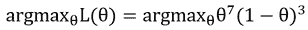

但是我们如何找到最大值呢？这通常是通过根据感兴趣的参数进行求导并将该求导设置为零来实现的:


嗯，我们选择了`...`因为懒惰:对于一个懒惰的人来说，太多的计算了。我们知道，通过最大化可能性或可能性的对数，我们会得到相同的结果。当我们使用对数时，解决方案往往容易得多。因此，在我们的例子中，我们希望最大化由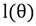表示的对数似然性:

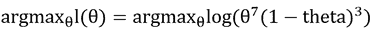

我们再次对求导，并将导数设为零，以获得最大值:


设置为零:


在这种情况下，来自直接估计的等于这个解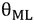。

## EM 算法的形式定义

让我们首先激励 EM 算法，根据它作为算法的初始公式，来估计数据集中的缺失值。

设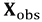和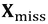为数据集的观察和缺失部分，设为待估计未知参数的向量。似然函数由给出，未知参数由观测数据的边际似然确定:


这个方程的封闭解往往过于复杂，因而需要一种迭代方法来求解这个方程。

EM 算法是一种迭代方法，它交替执行两个步骤:第 **E 步**(=期望步)和第 **M 步**(=最大化步)。在该方法中，似然函数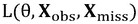相对于被最大化，这相当于最大化对数似然函数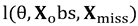:

1.  为参数选择一个初始值，比如说，设置 *n = 0* 。
2.  迭代直到收敛 2a) **E 步**:计算条件期望值。我们采用当前估计值给出的完整数据集的对数似然函数来对此进行估计。2b) ** M 步**:最大化:

## EM 算法的介绍性示例

正如你可能已经注意到的，这是一个相当复杂的通用符号。然而，在实践中，这变得更容易。在下面的例子中，我们想要解释基于一个简单的 *2 X 3* 表的 EM 算法，该表有一个丢失的单元格:

```r
y <- matrix(c(11, 22, 16, 24, 17, NA), nrow=2)
y
##      [,1] [,2] [,3]
## [1,]   11   16   17
## [2,]   22   24   NA

```

我们采用了一个线性模型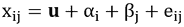和


。

如果我们知道的单元值，那么估计线性模型的系数就很简单，例如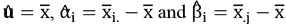。这里表示行方式的算术装置，而表示列方式的算术装置。我们不需要给出更多的解释来说明为什么这些是参数的合理估计，我们需要集中在 EM 算法上，以及如何为这个例子制定 EM。

在 EM 算法中，我们总是要选择初始值。因此，我们对缺失值进行初始化，例如，我们可以选择`y`的观测值的算术平均值进行初始化:

```r
m <- mean(y, na.rm = TRUE)
m
## [1] 18
y[2,3] <- m
y
##      [,1] [,2] [,3]
## [1,]   11   16   17
## [2,]   22   24   18

```

接下来我们开始迭代。我们使用下面的 *E* 和 *M* 步骤迭代地估算缺失值和合理值:

```r
## stop criterion
eps <- 0.001
## intitialisations
yalt <- y
n <- 0
converged <- FALSE
## iteration
while(!converged){
 n <- n + 1
 yalt <- y
 m1 <- mean(y)
 ## E-step (estimate parameters)
 a <- rowMeans(y) - m1
 b1 <- colMeans(y) - m1
 ## M-step (update y23)
 y[2, 3] <- m1 + a[2] + b1[3]
 ## stop criterion
 converged <- (abs(y[2, 3] - yalt[2, 3]) < eps)
}
list(yImp = y, iterations = n)
## $yImp
##      [,1] [,2]    [,3]
## [1,]   11   16 17.0000
## [2,]   22   24 26.4983
##
## $iterations
## [1] 21

```

我们看到我们需要 21 次迭代来获得 X23 的估算值的最终结果。我们很快会回到插补的问题，但首先我们将讨论 EM 算法的另一个应用。


# 以 k 均值聚类为例的 EM 算法

将观察值聚类成组的最著名的算法可能是 k-means 算法。我们会看到这个算法是 EM 算法的一个变种。

给定由 p 个变量表征的 *n 个*对象，我们喜欢将它们划分成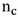簇，使得簇具有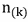个成员，并且每个观察值都在一个簇中。聚类的平均向量(中心，原型)Vk 被定义为聚类的质心，并且平均向量的分量可以通过来计算，其中是聚类中的观测值的数量，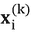是属于聚类的第 I 个观测值。对于每个聚类，计算相应的聚类平均值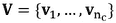。

我们还需要确定输出分区中的集群数量。从给定的聚类质心的初始位置开始，该算法使用数据点迭代地重新定位质心，并将点重新分配到最近的质心。该过程由以下步骤组成:

1.  选择一个带有簇的初始分区。
2.  使用当前的聚类成员资格来(重新)计算聚类中心。
3.  *M 步*:将每个对象分配到最近的聚类中心，新成员。
4.  转到步骤 2，直到集群成员和集群质心的变化不超过指定的界限。

-均值聚类优化目标函数:

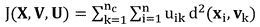

其中是带有观测值和变量的数据集，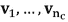是维度为的聚类中心(原型)矩阵，是带有隶属系数的矩阵，用于观测值 **xi** 到一个聚类。因此 **U** 的尺寸为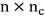。 *d* 是观测值和聚类中心之间的欧氏距离。决定集群的数量。

k-means 算法可以如下实现。固定，选择终止公差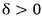，例如 *0.001* 。初始化(比如随机)。

重复进行 *r = 1，2、...*

1.  **E 步**:计算聚类中心:> 
2.  **M 步**:更新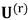:重新分配集群成员。
3.  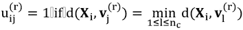 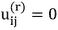
4.  否则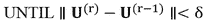。

我们在下面定义 k-means 的整个算法。这只是为了接触代码和算法。对于 k-means 的专业实现，参见例如(Leisch 2006)。

对于聚类算法，我们需要一个距离函数。我们使用曼哈顿距离:

```r
distMan <- function(x, centers){
 if(class(x) == "data.frame") x <- as.matrix(x)
 d <- matrix(0, nrow=nrow(x), ncol=nrow(centers))
 ## dist center to observations for each cluster
 for(k in 1:nrow(centers)){
 d[,k] <- abs( colSums((t(x) - centers[k,])) )
 }
 return(d)
}

```

我们需要一个计算平均值的函数，例如，我们可以使用算术平均值，但也可以使用中位数，如下所示:

```r
means <- function(x, cluster){
 cen <- matrix(NA, nrow=max(cluster), ncol <- ncol(x))
 ## cluster means for each cluster
 for(n in 1:max(cluster)){
 cen[n,] <- apply(x[cluster==n,], 2, median)
 }
 return(cen)
}

```

我们为 k-means 算法写了一个函数，这个函数实现了之前的公式。为了使一些图详细显示 EM 方法，我们在`for`循环中进行:

```r
my_kmeans <- function(x, k, clmeans = means, distance = distMan, iter = 99999, seed = NULL){
 if(!is.null(seed)) set.seed(seed)
 cent <- newcent <- x[sample(1:nrow(x), size=k), ]
 oldclust <- 0
 j <- 0
 for(i in 1:iter){ # better: while()
 j <- j + 1
 cent <- newcent
 ## M-step
 dist <- distance(x, cent)
 clust <- max.col(-dist)
 ## E-step
 newcent <- clmeans(x, clust)
 if(all(clust == oldclust)) break()
 oldclust <- clust
 } 
 res <- list(centers = cent,
 cluster = factor(clust),
 iterations = j)
 return(res)
}

```

正如我们所见，在 k-means 聚类中， *E-step* 是拟合步骤， *M-step* 是分配步骤。迭代 *E* 和 *M 步*迭代改进解。这意味着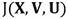在每次迭代中都会变小。如果聚类分配不再改变，我们就破坏该算法。

来废话点数据吧。我们希望保持简单，我们希望直观地显示集群。所以我们已经得到了一个二维数据集并在*图 9.1* 中显示出来。

```r
data(Nclus, package = "flexclust")
x <- data.frame(Nclus)
library("ggplot2")
qplot(X1, X2, data=data.frame(Nclus))

```


图 9.1:一个简单的二维数据集，在下面的例子中用于聚类(在这个数据集中找到四个组)

在下文中，我们绘制迭代 *1* 、 *2* 之后以及收敛之后的结果。我们不使用 k-means 算法的简化实现，而是使用 r 的默认 k-means 实现。存在 k-means 的一些变体，其中我们选择了算法`"MacQueen"`，但只是为了探索该算法(默认方法`"Hartigan-Wong"`收敛太快，无法显示算法的步骤)。注意，k-means 算法从随机选择的聚类中心开始。因此，我们必须设置`seed`,以确保 k-means 的每次调用都有相同的开始:

```r
set.seed(123456)
cl1 <- kmeans(x, centers = 4, iter.max = 1, algorithm = "MacQueen")
set.seed(123456)
cl2 <- kmeans(x, centers = 4, iter.max = 2, algorithm = "MacQueen")
set.seed(123456)
cl3 <- kmeans(x, centers = 4, iter.max = 3, algorithm = "MacQueen")
set.seed(123456)
cl4 <- kmeans(x, centers = 4, algorithm = "MacQueen")

```

然后，我们绘制出前两次迭代的 *E 步*和 *M 步*后的结果，以及最终解的结果。当从 k-means 结果访问聚类中心时，这可以很容易地完成，例如，对于一次迭代后的第一个解决方案:

```r
cl1$centers
##          X1          X2
## 1  4.787137  4.65547187
## 2  2.555571  2.20578465
## 3 -1.590451  4.32789868
## 4  7.997304 -0.08258293

```

迭代 *1* 、 *2* 和收敛后的解如图*图 9.2* 所示。计算出的中心( *E 步*)和观测值向最近聚类的分配( *M 步*)详细显示如下:


图 9.2:k-means 算法的解。左上:初始中心，迭代 1 中 E 步的解)。右上角:第一次将点分配给估计的中心，这是迭代 1 中 M 步的解决方案。左中:迭代 2 中的新中心。中右:新任务。左下角:中心的最终解决方案。右下:观测值最终分配给聚类中心

请注意， k-means 仅将中心纳入考虑范围，并使用距离函数来计算从观测值到聚类中心的距离。另一种(更有利的)方法是将它们合并到集群的形状中。这是在基于模型的聚类框架中实现的(Fraley 和 Raftery 2002)。基于模型的程序大多给出更好的聚类结果(Templ、Filzmoser 和 Reimann 2008)，但它们在计算上更复杂，因为在每个 *E-step* 中的必须额外计算每个聚类的协方差。


# 缺失值插补的 EM 算法

EM 算法广泛用于缺失值的插补。实现情况包括(范布伦和格罗图伊斯-奥德索恩，2011 年)，(斯查费，1997 年)，(Templ，Alfons 和 Filzmoser，2011 年)，(Raghunathan 等人，2001 年)，以及(盖尔曼和希尔，2011 年)。在下文中，我们想展示 EM 算法通常是如何解决这类问题的。

首先我们要估算一组数据。我们再次选择`sleep`数据:

```r
library("MASS")
library("robustbase")
library("VIM")
data("sleep")
str(sleep)
## 'data.frame':    62 obs. of  10 variables:
##  $ BodyWgt : num  6654 1 3.38 0.92 2547 ...
##  $ BrainWgt: num  5712 6.6 44.5 5.7 4603 ...
##  $ NonD    : num  NA 6.3 NA NA 2.1 9.1 15.8 5.2 10.9 8.3 ...
##  $ Dream   : num  NA 2 NA NA 1.8 0.7 3.9 1 3.6 1.4 ...
##  $ Sleep   : num  3.3 8.3 12.5 16.5 3.9 9.8 19.7 6.2 14.5 9.7 ...
##  $ Span    : num  38.6 4.5 14 NA 69 27 19 30.4 28 50 ...
##  $ Gest    : num  645 42 60 25 624 180 35 392 63 230 ...
##  $ Pred    : int  3 3 1 5 3 4 1 4 1 1 ...
##  $ Exp     : int  5 1 1 2 5 4 1 5 2 1 ...
##  $ Danger  : int  3 3 1 3 4 4 1 4 1 1 ...

```

缺失值包含在一些 all 变量中，如变量`Sleep`:

```r
apply(sleep, 2, function(x) any(is.na(x)))
##  BodyWgt BrainWgt     NonD    Dream    Sleep     Span     Gest     Pred
##    FALSE    FALSE     TRUE     TRUE     TRUE     TRUE     TRUE    FALSE 
##      Exp   Danger
##    FALSE    FALSE

```

我们如何估算变量`Sleep`中缺失的值？这可以通过执行回归拟合来完成。理想情况下，我们已经从性能良好的插补算法中初始化缺失值，例如，k-最近邻插补方法(Templ、Alfons 和 Filzmoser 2011)。然而，为了看到 EM 的进展，我们开始非常糟糕地初始化变量`Sleep`中的缺失值，使用了一个最差的初始化，只是用了一个大数。请注意，我们还需要缺失值的索引:

```r
## index of missing values
ind <- data.frame(is.na(sleep))
## initialization
sleep <- kNN(sleep)
## Time difference of 0.04911399 secs
## overwrite missing initialization with bad choice
sleep$Sleep[ind$Sleep] <- 2240  # bad initialization
## initialized missing values in variable sleep
sleep$Sleep[ind$Sleep]
## [1] 2240 2240 2240 2240

```

然后，我们为第一个变量拟合一个模型。然后，模型结果(回归系数)用于预测缺失值:

```r
## E-step (1)
lm1 <- lm(Sleep ~ log(BodyWgt) + log(BrainWgt) + NonD + Danger, data = sleep)
## M-step (1)
sleep$Sleep[ind$Sleep] <- predict(lm1)[ind$Sleep]
## print of updated missing values
sleep$Sleep[ind$Sleep]
## [1] 469.5127 559.9771 408.6845 229.0985

```

我们可以继续第二次迭代。

```r
## E-step (2)
lm1 <- lm(Sleep ~ log(BodyWgt) + log(BrainWgt) + NonD + Danger, data = sleep)
## M-step (2)
sleep$Sleep[ind$Sleep] <- predict(lm1)[ind$Sleep]
## print of updated missing values
sleep$Sleep[ind$Sleep]
## [1] 101.9265 121.6146  90.1618  48.7181

```

我们看到价值观仍然变化很大。让我们反复这样做，直到这些值的变化不会超过一个非常小的阈值。我们可以为变量`Sleep`的插补编写一个小函数:

```r
EMregSleep <- function(method = lm, eps = 0.001, init = "bad"){
 ## index of missing values
 ind <- is.na(sleep)
 colnames(ind) <- colnames(sleep)
 indsleep <- ind[, "Sleep"]
 ## initialization
 if(init == "bad"){
 sleep <- kNN(sleep, imp_var = FALSE)
 sleep$Sleep[indsleep] <- 2240  # bad initialization
 }
 if(init == "worst"){
 sleep[ind] <- 2240  # worst initialization
 }
 iteration <- 0
 criteria <- 99999
 while(criteria > eps){
 iteration <- iteration + 1
 prev_sol <- sleep$Sleep[indsleep]
 ## E-step
 lm1 <- method(Sleep ~ log(BodyWgt) + log(BrainWgt) + NonD + Danger,
 data = sleep)
 ## M-step
 sleep$Sleep[indsleep] <- predict(lm1)[indsleep]
 criteria <- sqrt(sum((prev_sol - sleep$Sleep[indsleep])^2))
 }
 res <- list("imputed" = sleep, 
 "iteration" = iteration,
 lastmodel = lm1)
 return(res)
}

```

我们再次加载数据集`sleep`，对其进行估算，查看变量`Sleep`中的估算值:

```r
data("sleep")
sleepImp <- EMregSleep()
## Time difference of 0.179677 secs
missVals <- sleepImp$imputed$Sleep[ind$Sleep]
missVals
## [1]  3.845778 13.122764  3.658173 16.975766
sleepImp$iteration
## [1] 11

```

但是，我们使用期望值进行估算，这将导致方差减少，因为我们没有考虑缺失值的不确定性和分布(将方差估计与第 8 章[、*中的缺失值进行比较*。为了考虑方差，我们对残差进行采样(比较](ch08.xhtml "Chapter 8. Applications of Resampling Methods and Monte Carlo Tests")[第 8 章](ch08.xhtml "Chapter 8. Applications of Resampling Methods and Monte Carlo Tests")、*中的自举残差回归方法，重采样方法的应用和蒙特卡洛测试*):

```r
missVals + sample(residuals(sleepImp$lastmodel), length(missVals))
##        13        33         6        59
##  3.763077 11.708266  4.191778 17.465241

```

### 注意

请注意，为了正确估计方差，我们可能不止估算一次，而是估算多次，从而产生几个估算数据集，从中可以计算出正确的方差(多重估算方法)。或者，我们使用 Bootstrap 方法来考虑缺失值的不确定性，参见[第 8 章](ch08.xhtml "Chapter 8. Applications of Resampling Methods and Monte Carlo Tests")、*重采样方法和蒙特卡洛测试的应用*。

之前我们看到我们需要 11 次迭代。此外，OLS 回归模型也可能受到异常值的影响，因此最好用稳健的方法来代替它。

在第一次迭代之后，我们已经看到了好的结果(这里没有显示)。我们得到的结果略有不同，但通常比使用非稳健方法更可信(Templ、Kowarik 和 Filzmoser 2011)。

OLS 结果可能会被破坏，尤其是预测值中也有异常值。然而，我们看到，即使使用最差的初始化(预测值中也有巨大的异常值)，结果看起来也很好(尽管我们更喜欢稳健的方法):

```r
data("sleep")
## OLS regression
lm_ols <- EMregSleep(method = lm, init = "worst")
## M-estimation
lm_rlm <- EMregSleep(method = rlm, init = "worst", eps= 0.01)
lm_ols$imputed$Sleep[ind[, "Sleep"]]
## [1]  4.239191  8.169014  4.368256 13.775087
lm_rlm$imputed$Sleep[ind[, "Sleep"]]
## [1]  3.766792  7.788943  3.925772 13.700029

```

从这些数字中我们可以看出，OLS 结果受异常值的影响很大。与之前的估计值相比(使用了不好的初始化，而不是最差的初始化)，估算值太高了。当使用 M 估计量时，这并不极端，但是与函数`irmi`(见下面的例子)中的实现相比，我们低估了第二个和第四个值。

我们已经讨论了如何估算一个变量，但一般来说，我们希望估算一个数据集中的所有变量。数据集不仅可以由连续变量组成，还可以由连续、半连续、分类、二进制和/或计数变量的混合组成。基于 EM 的稳健插补解决了这一问题(以及更多问题，例如为每个变量指定模型)，并在 R 包`VIM` (Templ、Alfons 和 Filzmoser，2011 年)的函数`irmi` (Templ、Kowarik 和 Filzmoser，2011 年)中实现:

```r
data("sleep")
sleepImp <- irmi(sleep)
## Time difference of 0.03798294 secs
sleepImp[ind[, "Sleep"], "Sleep"]
## [1]  3.748899 10.089591  3.156300 17.085060

```

我们看到这个非常接近初始解，在那里我们对缺失值进行了更好的初始化。这表明了`irmi`的成功。我们可以使用另一种方法，如`mice`(因为`irmi`通常用于多重插补):

```r
library("mice")
## Loading required package: Rcpp
## mice 2.25 2015-11-09
data("sleep")
em_mice <- mice(sleep, m = 1)
##
##  iter imp variable
##   1   1  NonD  Dream  Sleep  Span  Gest
##   2   1  NonD  Dream  Sleep  Span  Gest
##   3   1  NonD  Dream  Sleep  Span  Gest
##   4   1  NonD  Dream  Sleep  Span  Gest
##   5   1  NonD  Dream  Sleep  Span  Gest
em_mice$imp$Sleep
##       1
## 21 12.5
## 31 14.5
## 41  6.1
## 62 14.4
## now with bad intitialisation in predictors
sleep[is.na(sleep)] <- 2240
sleep$Sleep[ind[, "Sleep"]] <- NA
em_mice <- mice(sleep, m = 1)
##
##  iter imp variable
##   1   1  Sleep
##   2   1  Sleep
##   3   1  Sleep
##   4   1  Sleep
##   5   1  Sleep
em_mice$imp$Sleep
##       1
## 21  3.8
## 31  3.1
## 41  3.8
## 62 10.6

```

我们看到我们得到了一个完全不同的结果，因为数据集中很快就出现了异常值。对于 EM 算法的其他实现来说，这也是正确的,只有当数据集大约为。多元正态分布。一旦违反了这一点(实践中通常就是这种情况)，`irmi`可能是一个不错的选择。

注意在`irmi` 中可以指定许多其他参数(此处不讨论):

```r
args(irmi)
## function (x, eps = 5, maxit = 100, mixed = NULL, mixed.constant = NULL,
##     count = NULL, step = FALSE, robust = FALSE, takeAll = TRUE, 
##     noise = TRUE, noise.factor = 1, force = FALSE, robMethod = "MM",
##     force.mixed = TRUE, mi = 1, addMixedFactors = FALSE, trace = FALSE,
##     init.method = "kNN", modelFormulas = NULL, multinom.method = "multinom")
## NULL

```


# 总结

EM 算法是一种寻找最大似然估计的解的计算方法。基本上，EM 算法包括两步，用于估计参数的 *E 步*和用于根据实际参数最大化的 *M 步*。该算法通常收敛速度快，应用领域广。

在这一章中，我们看到了在聚类和缺失值插补两个领域的应用。聚类是一个 *NP-hard* 问题；粗略地说，我们无法在合理的时间内找到精确的封闭解。因此，EM 算法对于交互式地找到好的解决方案是必要的。在聚类分析中，EM 算法是为 k-means 聚类分析算法实现的，但也是为基于模型的聚类分析和一般的混合模型实现的(本章未介绍)。

在实际数据集中，缺失值经常出现。数据科学家可能是那些主要工作是数据预处理的人，因此他们也必须估算缺失值。我们看到 EM 算法是这项任务的核心工具。


# 参考文献

*   邓普斯特，A.P .，N.M .莱尔德和 D.B .鲁宾。1977.“通过 EM 算法获得不完整数据的最大似然性(附讨论)，*英国皇家统计学会杂志，B 辑*39(1):1–38。
*   弗雷利，c .和 e .拉夫特里。2002.“基于模型的聚类、判别分析和密度估计”，*美国统计协会杂志*97:611–31。
*   盖尔曼和 j .希尔。2011.《打开黑匣子的窗户》，《统计软件学报》第 40 期。
*   Leisch，F. 2006。“K-质心聚类分析工具箱”，*计算统计与数据分析*51(2):526–44。doi: `10.1016/j.csda.2005.10.006`。
*   Raghunathan、Trivellore E、James M Lepkowski、John Van Hoewyk 和 Peter Solenberger。2001.“使用一系列回归模型多重输入缺失值的多元技术”，*调查方法学*27(1):85–96。
*   斯查费，法学博士，1997 年。*不完全多元数据分析*。查普曼&霍尔/CRC 统计学专著&应用概率。CRC 出版社。https://books.google.at/books?id=3TFWRjn1f-oC[。](https://books.google.at/books?id=3TFWRjn1f-oC)
*   Templ，m .，A. Alfons 和 P. Filzmoser。2011.“使用可视化技术探索不完整的数据”，*数据分析和分类的进展*6(1):29–47。
*   Templ，m .，P. Filzmoser 和 C. Reimann。2008.“聚类分析应用于区域地球化学数据:问题与可能性”，*应用地球化学*23(8):2198–2213。
*   Templ，m .，A. Kowarik 和 P. Filzmoser。2011.“使用标准和稳健方法的迭代逐步回归插补”。统计。数据分析。55 (10): 2793–2806.
*   van buu ren s .和 k . Groothuis-oudshorn。2011.“小鼠:R 中链式方程的多元插补”，*统计软件杂志*45(3):1–67。http://www.jstatsoft.org/v45/i03/[。](http://www.jstatsoft.org/v45/i03/)