# 十、复杂数据模拟

估计量在有限样本中有偏差吗？在偏离假设的情况下，估计量是一致的吗？不同假设下的抽样方差是否被低估/高估？在偏差、精度等方面，方法 *A* 是否比方法 *B* 提供更好的特性？测试的规模是否正确(在零假设下达到名义覆盖水平)？一个测试的功效比其他测试大吗？

所有这些问题都可以通过统计模拟来回答。这些问题中的一些已经在第 6 章、*模拟展示的概率理论*中得到回答，其中通过模拟展示了偏差、大数和中心极限定理的概念。我们还在[第 7 章](ch07.xhtml "Chapter 7. Resampling Methods")、*重采样方法*中看到了基于蒙特卡罗的置信区间估计(例如，使用 bootstrap)，并且我们已经在第 8 章中详细讨论了蒙特卡罗测试方法。

本章通过引入更复杂的模拟和复杂的数据生成来增强前面的章节。因此，在缺乏分析性质和分析结果的知识的情况下，我们现在将对这些问题给出进一步的答案。一般来说，由于现代统计方法的复杂性，获得关于其性质的分析结果实际上常常是不可能的。因此，统计学家广泛使用模拟研究作为基于数据的计算机密集型替代方法，以深入了解开发方法的质量，另见 Alfons、Templ 和 Filzmoser 2010a。

现在进行模拟以显示方法在某些条件下是否工作良好，只要估计量的性质不能以分析的方式显示。这是现在经常出现的情况，特别是对于复杂的方法和复杂的估计。

正如在[第 8 章](ch08.xhtml "Chapter 8. Applications of Resampling Methods and Monte Carlo Tests")、*重采样方法的应用和*蒙特卡罗测试*部分的*中已经部分讨论过的，模拟研究通常包括以下步骤来回答关于估计量性质的问题:

1.  起点是一个给定的数据集或一组关于数据集性质和参数的假设。
2.  合成数据集由概率模型模拟，其中这些假设应尽可能满足。如此重复以获得 R 个数据集，其中 R 较大(例如，R = 10,000)。
3.  估计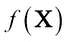在每个合成数据集上进行(例如，估计指标、模型系数、方差估计等)。如果我们得到 R 个数值，比如估计量/检验统计量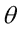的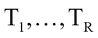，我们就得到参数估计的经验分布。
4.  将从这些模拟数据集中获得的参数估计的分布与真实参数值进行比较。跨越的汇总统计应该是估计量/测试统计的真实抽样属性的良好近似。

### 注意

注意，在模拟设置中，`true`参数值通常是预先已知的。我们模拟具有已知属性的数据集。我们重复模拟合成数据集，以*平均出*数据模拟过程的随机性。对于功效比较，(参见[第 8 章](ch08.xhtml "Chapter 8. Applications of Resampling Methods and Monte Carlo Tests")、*重采样方法和蒙特卡罗测试*在安德森-达令测试中的应用)模拟应判断假设测试的性质(测试的大小和功效)。

# 不同种类的模拟和软件

模拟的结构很大程度上取决于特定的任务。通常统计模拟实验是在简化的条件下进行的。例如，为了判断一种方法，使用单变量或多变量正态分布来模拟随机数。然后将该方法应用于模拟数据。这种模拟通常不会显示估计方法的特征，因为数据结构在实践中通常要复杂得多，并且很难推导出真实世界的行为。因此，模拟随机数的方法，如第 4 章中的[和中的*所示，可能不足以进行复杂的模拟研究。对于教学、微观模拟研究、远程执行任务和复杂模拟研究，必须模拟复杂数据。*](ch04.xhtml "Chapter 4. Simulation of Random Numbers")

通常，我们谈论和进行基于**模型的**模拟研究。在基于模型的模拟世界中，首先，数据由超级群体模型随机抽取。在这种情况下，真实参数是已知的。其次，对这些人工数据应用估计方法。将得到的估计值与*真值* -已知的真实人口参数值进行比较。然后可以决定偏差和所有其他在第 6 章、*随机数模拟*(一致性、渐近收敛)中讨论的属性...)，例如，当所有模型假设成立时，一个方法应该产生理论上预期的结果。

如果数据是用复杂的采样设计绘制的,最好的选择是在随机模拟数据时考虑这种设计。然后我们可以谈谈基于设计的模拟研究。换句话说，在基于设计的模拟中，随机样本是根据固定的采样设计从有限的总体中抽取的。我们这样做是为了重现调查过程。一个困难是首先模拟一个模拟真实人口的重要特征的真实人口。

在本章中，我们将展示如何为复杂的模拟任务模拟数据。我们还将讨论 R 包 *simFrame* (Alfons、Templ 和 Filzmoser 2010a)在基于模型和设计的仿真研究中的应用，从几个基于模型的仿真示例开始。基于设计的模拟特别局限于勘测方法。然而，它也是不在官方统计领域工作的数据科学家感兴趣的，因为通过复杂的模拟设计，我们展示了模拟的一般框架。一般来说，项目通常涉及许多人，通常来自不同的机构，每个人关注项目的不同方面。如果这些人使用不同的模拟设计，结果可能无法比较，进而无法得出有意义的结论。因此，这类研究项目中的模拟研究需要一个精确的轮廓。此外，稍微更改设置可能会导致整个模拟崩溃。模块化设计的一般框架有助于修改部分代码，并减少模拟编程中的错误。因此，用于统计模拟的软件框架可能有助于避免这样的问题。为此，开发了 R 包`simFrame` (Alfons、Templ 和 Filzmoser 2010a)。具有 S4 类和方法的面向对象实现提供了对输入和输出的最大控制，并为用户定义的扩展提供了清晰的接口。此外，该框架允许仅通过少量编程来使用广泛的仿真设计。

本章基于设计的模拟部分的内容取决于与 Andreas Alfons 之前的联合研究工作，从而产生了`simFrame`包。


# 使用复杂模型模拟数据

新观点总是受到怀疑，而且通常遭到反对，没有任何其他原因，只是因为它们还不普遍。约翰·洛克(1689 年)。

当讨论合成数据的用处时，人们经常会遇到以下观点:“我们有真实的数据可用，所以我们不需要合成数据！”；"其他人也不处理合成数据！"；“合成数据不是真实数据！”；“使用合成数据，我们失去了数据可信度！”；“我们有更重要的事情要做！”；"合成数据是科学的木马！"

但合成人口数据集并不打算取代所有研究目的的传统数据集，当然也不会减少收集更多更好数据的需求。但是它们越来越多地用于多种实际应用。合成数据生成通过创建*替换数据集*使机密数据集中包含的信息的传播和使用成为可能，替换数据集可以作为公共使用文件共享，用于研究、培训目的，或者在不允许研究人员使用真实数据时，作为结构数据文件用于统计披露控制中的远程执行任务。合成数据生成还允许创建新的、更丰富的或*增强的*数据集，为微观模拟(包括空间微观模拟)和基于代理的建模提供关键输入。这些数据集对决策者和发展实践者特别有吸引力，他们将这些数据集作为模拟模型的输入，用于评估政策和计划的事前分配影响。多个部门都有这样的例子，包括卫生部门(Barrett 等人，2011 年)，(Brown 和 Harding，2002 年)，(Tomintz，Clarke 和里格比，2008 年)，(Smith，Pearce 和 Harland，2011 年)，运输部门(Beckman，Baggerly 和 McKay，1996 年)，(Barthelemy 和 Toint，2013 年)，环境部门(Williamson，Mitchell 和 McDonald，2002 年)，等等。最后，复杂的模拟研究需要合成数据来比较和验证方法。

我们将从简单的例子开始，并通过创建一个可以用于前面描述的许多任务的整体来结束本章。

## 基于模型的简单示例

为了模拟来自标准多元正态分布的具有 100 个观察值的数据集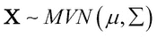,我们可以使用以下代码:

```
library("mvtnorm")
synth <- rmvnorm(100, mean = rep(0,5), sigma = diag(5))
## first three observations
head(synth, 3)
##              [,1]        [,2]      [,3]       [,4]        [,5]
## [1,]  0.644138924 -0.02072223 -0.746322 -0.9706192 -0.04744456
## [2,] -0.154906805 -1.45176977  1.791701  1.0259287 -0.07375616
## [3,] -0.004602993  0.54685023 -1.353268 -0.2535821  1.38033904

```

如果我们希望模拟数据与真实数据更“相似”，我们可以使用从这种真实数据估计的均值和协方差矩阵。我们再次从包`car`中取出`Prestige`数据，但是只有前四列，因为我们没有讨论如何模拟不同种类分布的混合，并且`Prestige`的后两列与前四列(连续)不同(分类)。我们将首先选择数据集:

```
data(Prestige, package = "car")
## first three observations of Prestige
head(Prestige, 3)
##                    education income women prestige census type
## gov.administrators     13.11  12351 11.16     68.8   1113 prof
## general.managers       12.26  25879  4.02     69.1   1130 prof
## accountants            12.77   9271 15.70     63.4   1171 prof
## subset of variables
real <- Prestige[, 1:4]

```

以下代码用于模拟来自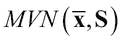的新数据集，其中为列平均值，为原始数据集的估计协方差:

```
## set seed for reproducibility
set.seed(12)
## simulate from multivariate normal
synth2 <- data.frame(rmvnorm(100, mean = colMeans(real), sigma = cov(real)))
colnames(synth2) <- colnames(real)
## first three observations
head(synth2, 3)
##   education    income      women prestige
## 1  8.891485 13494.060 -23.687773 50.86117
## 2  6.095841  5635.296  20.595593 32.52649
## 3  8.822570  8609.970  -2.522208 34.78179

```

这个结果可以接受吗？我们能在模拟研究中使用这一代合成数据吗？答案取决于模拟的目的，但最有可能的是随机数的模拟过于简单。我们可以看到变量`women` 有问题，它的值应该在`0`和`100`之间。

```
summary(real$women)
##    Min. 1st Qu.  Median    Mean 3rd Qu.    Max.
##   0.000   3.592  13.600  28.980  52.200  97.510
summary(synth2$women)
##    Min. 1st Qu.  Median    Mean 3rd Qu.    Max.
## -39.700   6.608  26.580  25.310  47.660 111.600

```

当我们从原始数据和合成数据中绘制两个变量时，我们可以看到多元结构不同。首先，由于声望增加而增加的方差对于合成数据来说是不可见的，此外，来自合成观察的较大值稍微向右偏移，参见*图 10.1* :

```
par(mar = c(4,4,0.2,0.2))
plot(prestige ~ income, data = real)
points(prestige ~ income, data = synth2, col = "red", pch = 20)
legend("bottomright", legend = c("original/real", "synthetic"), col = 1:2, pch = c(1,20))

```

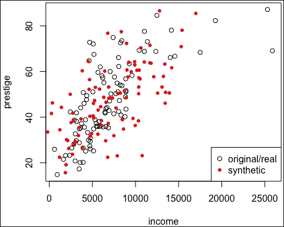

图 10.1:来自声望数据(黑色圆圈)和模拟合成数据(红色实心圆圈)的两个变量

这是由于异常值，这可能会扰乱均值和协方差估计。作为一种解决方法，我们可以分别模拟好的数据点和*坏的*数据点。

## 基于模型的混合示例

通常，如果数据具有聚类结构，可以使用混合模型。我们现在只考虑这两种混合，一种包含好的数据点，另一种包含潜在的异常值。我们分别模拟两种分布的数据。协方差和位置的异常值稳健估计可以用各种估计器来完成。我们采用了一个简单快速的方法，MCD 估计量(Rousseeuw 和 Driessen 1998)。在*图 10.2* (左侧图形)中，我们可以看到数据比以前更加吻合。如果我们将异常值和非异常值的数据生成分开，我们会得到一个更好的合成数据集，参见*图 10.2* (右图)。

```
library("robustbase")
cv <- covMcd(real)
synth3 <- rmvnorm(100, mean = cv$center, sigma = cv$cov)
par(mfrow = c(1,2), mar = c(4,4,0.2,0.2))
plot(prestige ~ income, data = real)
points(prestige ~ income, data = synth3, col = "red", pch = 20)
## add outliers
rmd <- mahalanobis(real, center = cv$center, cov = cv$cov)
## outliers defined by large Mahalanobis distances
out <- rmd > qchisq(0.975, ncol(real) - 1)
cv_good <- covMcd(real[!out, ])
## simulate good points
synth3_good <- rmvnorm(100, mean = cv_good$center,
 sigma = cv_good$cov)
cv_out <- covMcd(real[out, ])
## simulate outliers
synth3_out <- rmvnorm(100, mean = cv_out$center,
 sigma = cv_out$cov)
## Figure 10.2.
plot(prestige ~ income, data = real)
points(prestige ~ income, data = synth3_good,
 col = "red", pch = 20)
points(prestige ~ income, data = synth3_out,
 col = "red", pch = 20)

```


图 10.2:来自声望数据(黑色圆圈)和模拟合成数据(红色实心圆圈)的两个变量。对于右侧的图形，模拟分别针对异常值和非异常值进行

当然，我们也可以使用除了多元正态分布之外的其他分布，比如多元柯西或多元 t 分布。创建包含异常值的数据集的替代方法是手推车污染设置(斯塔赫尔和麦克勒，2009 年)。在这里，离群值是由可能产生较大形状偏差的分布产生的。我们不会详细讨论这种方法，但会参考包含这种方法功能的 R 包`robustX`(斯塔赫尔、麦克勒等人，2013)。来自多元数据集的稳健估计器可能会将此用于基准数据集。

## 基于模型的数据模拟方法

我们也可以使用基于模型的方法。为了模拟教育，我们可以简单地根据一组精心选择的预测指标来回归教育。为了简单解释这个问题，我们将把所有其他变量作为没有交互作用的预测因子。我们可以对真实数据进行拟合，然后使用该模型替代教育(在新的数据集中)，并基于该模型的残差添加一些误差。记住，[第九章](ch09.xhtml "Chapter 9. The EM Algorithm")，*EM 算法*也增加了错误:

```
synth4 <- real
lm1 <- lm(education ~ ., data = real)
synth4$education <- predict(lm1, synth4[, 2:ncol(synth4)]) + sample(residuals(lm1))

```

我们可以对所有变量都这样做。例如，我们可以将声望数据的第二个变量作为响应，将其余变量作为预测变量。同样，我们在真实样本上拟合模型，并在合成数据上进行拟合:

```
p <- ncol(real)
for(i in 1:ncol(real)){
 df <- real[, i]
 df <- cbind(df, real[,-i])
 colnames(df)[1] <- "response"
 lm1 <- lm(response ~ ., data = df)
 synth4[, i] <- predict(lm1, synth4[, -i]) + sample(residuals(lm1))
}

```

很容易进一步修改这种插补方法以获得 EM 算法(见[第 9 章](ch09.xhtml "Chapter 9. The EM Algorithm")，*EM 算法*)。

R 包`simPop` (Templ、Kowarik 和 Meindl，2016 年)中给出了基于模型的数据生成的实现，其中一组模型可用于模拟变量(多标称模型、两步方法、线性模型、回归树、随机森林、概率方法等)。

## 模拟高维数据的例子

在最后一个示例中，数据拟合的特定模型用于模拟新数据集。但是对于不同的设置，变量之间的关系是由一个潜在的模型来表达的。假设存在可以生成高维数据的潜在模型，这对于高维数据的模拟特别有用。为此，我们可以用观察值和变量模拟一个数据集，例如，通过下面的潜在模型，其中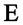的列与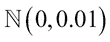正态独立分布。矩阵的列来自标准正态分布，而的元素来自中的均匀分布。在 R 中，这可能看起来像:

```
simLatent <- function(n = 200, p = 50, k = 3){
 T <- matrix(rnorm(n * k, 0, 1), ncol = k)
 B <- matrix(runif(p * k, -1, 1), ncol = k)
 X <- T %*% t(B)
 E <-  matrix(rnorm(n * p, 0, 0.1), ncol = p)
 XE <- X + E
 return(XE)
}

```

以为例，为了用一个六分量潜在模型模拟 50 个观测值的 1000 个变量，我们可以键入以下内容:

```
x <- simLatent(n = 50, p = 1000, k = 6)
dim(x)
## [1]   50 1000

```

## 模拟具有集群或等级结构的有限群体

通常，在基于设计的模拟研究中，评估取样设计对方法的影响。通过模拟一个群体并从这个综合群体中通过复杂的抽样设计绘制调查图，我们模拟了现实。所以第一个目标是模拟一个群体。

合成数据集必须是现实的，即在统计上等同于感兴趣的实际人群，并呈现以下特征(Münnich 等人，2003 年)，(Münnich 和 Schürle，2003 年)，(Alfons 等人，2011 年)，(Templ 和 Filzmoser，2014 年)，(Templ，Kowarik 和 Meindl，2016 年):

*   按地区和阶层划分的合成人口的分布必须与真实人口的分布非常相似
*   变量之间的边际分布和相互作用必须准确地表示出来
*   必须允许亚组之间的异质性，尤其是区域方面的异质性
*   应该保留集群和层次结构
*   合成群体中的记录不应通过单位的纯粹复制来创建

合成数据生成允许我们分发机密数据，也允许创建新的、更丰富的或*增强的*数据集，为微观模拟和基于代理的建模提供输入。

生成合成人口数据的想法并不新鲜。(Rubin 1993)，建议使用多重插补生成合成微观数据。但是方法和算法是不断进化的。R 包`simPop`等工具的公开可用性有助于进一步评估和改进技术。

`simPop`提供了 R 中各种方法的高度优化的`S4`类实现，包括通过迭代比例拟合和模拟退火进行校准，以及通过逻辑回归进行建模或数据融合。

已经提出了多种方法来生成合成群体数据，这些方法可以分为三大类:合成重建、组合优化和基于模型的数据生成。后一种方法将在下面的段落中简要说明。

它包括首先从现有的微观数据中导出一个人口模型，然后*预测*一个合成人口。因此，拟合是在现有的微观数据和人口水平的预测。在第一步，家庭结构(例如，按年龄和性别，以及潜在的其他变量)是通过对现有数据进行重采样建立的，重采样的概率取决于采样权重。然后，通过从观察到的条件分布中随机抽取，使用多标称逻辑回归模型来模拟额外的分类变量。第三步，使用回归建模生成连续和半连续变量。

我们将简要展示如何使用 R 包`simPop`模拟合成群体。我们将从给定的微观数据开始:

```
library("simPop")
data("eusilcS")
dim(eusilcS)
## [1] 11725    18

```

这 18 个变量的描述请看`?eusilcS`。

家庭数量为:

```
length(unique(eusilcS$db030))
## [1] 4641

```

在模拟变量之前，我们可以创建(使用`specifyInput()`)一个`dataObj`类的对象，它将保存构建合成群体所需的所有信息。我们可以在这里确定提供聚类信息的变量:家庭、家庭规模、阶层和抽样权重(变量`rb050`):

```
inp <- specifyInput(eusilcS, hhid = "db030", hhsize = "hsize",
 strata = "db040", weight = "rb050")

```

使用打印方法显示该`dataObj`类对象内容的摘要:

```
print(inp)
##
##  -------------- 
## survey sample of size 11725 x 19 
## 
##  Selected important variables: 
## 
##  household ID: db030
##  personal ID: pid
##  variable household size: hsize
##  sampling weight: rb050
##  strata: db040
##  --------------

```

函数`simStructure`使用复制方法生成合成群体的结构:

```
synthP <- simStructure(data = inp,
 method = "direct",
 basicHHvars = c("age", "rb090", "db040"))

```

使用综合人口的家庭结构和样本微观数据作为输入来模拟分类变量，两者都包含在类别`simPopObj`的`synthP`对象中。在我们的例子中，我们通过应用`simCategorical()`生成关于经济地位(变量`pl030`)和公民身份(变量`pb220a`)的分类变量:

```
synthP <- simCategorical(synthP,
 additional = c("pl030", "pb220a"),
 method = "multinom")

```

下面的变量:`age category`、`gender`、`household size`、`economic status`、`citizenship`通过调用`simContinuous`作为`personal net income`的预测变量:

```
synthP <- simContinuous(synthP, additional = "netIncome",
 upper = 200000, equidist = FALSE,
 imputeMissings = FALSE)

```

最终人口的基本信息如下所示:

```
synthP
##
## --------------
## synthetic population  of size 
##  81838 x 11
##
## build from a sample of size
## 11725 x 19
## -------------- 
## 
## variables in the population:
## db030,hsize,age,rb090,db040,pid,weight,pl030,pb220a,netIncomeCat,netIncome

```

现在可以将该群体输入基于设计的模拟研究中，从该群体中抽取样本。


# 基于模型的模拟研究

如前所述，在某些情况下，精确数学处理的制定和实现往往过于困难或耗时。通过使用基于模型的模拟，只要数据不是用复杂的采样设计采样的，我们就可以近似真实世界的情况和结果。基于模型的模拟研究比估计量或方法的数学证明需要更少的时间、精力和/或金钱。

### 潜在模型示例续

我们将继续使用前面例子中的潜在模型。这样的数据集我们可以用来比较方法。例如，可以将值标记为缺失，通过适当的插补方法对其进行插补，并对插补方法进行评估和比较。我们可以通过一个较小数据集的例子来做到这一点，并通过使用一个基于距离的简单精度误差标准来比较均值插补、最近邻插补、基于稳健模型的插补和由`mice`进行的插补:

```
library("mice")
library("VIM")
x <- orig <- simLatent(n = 50, p = 10, k = 6)
## evaluation criteria
eval <- function(real, imputed, nas){
 sqrt(sum((real - imputed)^2)) / nas
}
set.seed(123)
R <- 100
e1 <- e2 <- e3 <- e4 <- numeric(R)
for(i in 1:R){
 x <- orig
 x[sample(1:nrow(x), 10), 1] <- NA
 e1[i] <- eval(orig, e1071::impute(x), 10)
 e2[i] <-   eval(orig, kNN(data.frame(x), imp_var = FALSE), 10)
 e3[i] <-   eval(orig, irmi(x), 10)
 e4[i] <-   eval(orig, complete(mice(x, m = 1, printFlag = FALSE)), 10)
}
df <- data.frame("error" = c(e1,e2,e3,e4), method = rep(c("mean", "kNN", "irmi", "mice"), each = R))

```

箱线图是比较模拟结果分布的最方便的方法。参见*图 10.3* 根据我们的简单精度误差测量的方法比较:

```
library("ggplot2")
ggplot(df, aes(x = method, y=error)) + geom_boxplot() + 
 theme(text = element_text(size = 20)) + theme_bw()

```


图 10.3:精度误差的平行箱线图

为了比较这些插补方法，需要额外的标准(误差测量),还应估计覆盖率。我们将跳过这一步，参考 Templ、Kowarik 和 Filzmoser (2011)的研究结果。我们的目的是展示一个可以简单地适应这些新措施的模拟。我们稍后将展示如何使用包`simFrame`进行这类模拟。

### 基于模型的模拟的简单示例

我们将从一个简单的例子开始。在第 6 章的[中，模拟展示的*概率论中，我们抽取了 10 个大小的样本，每个样本来自一个分布。所以超级种群模型是一个带有种群参数的指数分布(密度由给出)。我们想要比较独立同分布样本的总体均值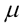的四种估计量:算术均值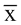、中位数、10%修整均值和 Huber 均值(Huber 1981)。在下面的例子中，我们想知道 Huber 均值(Huber 1981)是否是均值的无偏估计量，另外，bootstrap 估计的置信区间是否很好地覆盖了真实均值。由于分布是不对称的，我们期望对于没有异常值的数据，算术平均值是 1，但是对于任何其他估计量，结果不等于 1。我们将通过模拟展示这一点。休伯均值基于休伯损失函数，与平方误差损失相比，休伯损失函数对数据中的异常值不太敏感。离群值被向下加权以具有有限的影响，而相比之下，算术平均值离群值可以对估计值具有无限的影响。我们想看看 Huber 平均值是否等于算术平均值。请注意，这也可以通过分析来显示，但请记住，通过模拟，我们可以更容易地做到这一点。此外，我们希望在存在测量误差和效率的情况下，比较所有均值估计量的精度:*](ch06.xhtml "Chapter 6. Probability Theory Shown by Simulation")

```
library("robustbase")
set.seed(123)
x <- rexp(n = 50, rate = 1)
mean(x)
## [1] 1.130371
huberM(x)$mu
## [1] 0.9416643

```

乍一看，这似乎是正确的。两个估计量都接近 1，尽管 Huber 平均值比算术平均值更接近 1。但是我们来看看如果重复模拟随机数和均值计算一万次的结果。我们将报告 10，000 个结果的算术平均值。我们会看到，算术平均值是一个无偏估计量，即，用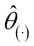表示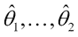的算术平均值:

```
m <- mean(replicate(10000, mean(rexp(n = 50, rate = 1))))
m
## [1] 0.9993768
m - 1
## [1] -0.0006231643

```

我们可以看到，指数分布变量的 Huber 均值不是 1 而是在`0.854`附近，偏差大约是`-0.146`:

```
mh <- mean(replicate(10000, huberM(rexp(n =50, rate = 1))$mu))
mh
## [1] 0.8542077
mh - 1
## [1] -0.1457923

```

这是正常的，因为指数分布是非对称分布，所以与 Huber 平均值进行比较可能不是最佳选择。接下来，我们要看看算术平均值估计量的覆盖范围。每个模拟的随机样本导致对的不同估计。我们可能想知道有多少区间包含了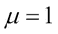的真值？下面的函数估计指数分布随机数的置信区间:

```
set.seed(123)
alpha <- 0.05
ci <- function(x, z = qnorm(1 - alpha / 2)){
 s <- rexp(n = 50, rate = 1)
 m <- mean(s)
 se <- sd(s) / sqrt(50)
 ci_est <- c(m - z * se, m + z *se)
 ci_est
}
ci()
## [1] 0.7970204 1.4637213

```

我们将复制这个 100，000 次，并报告有多少个区间包含值 1:

```
set.seed(123)
ciR_n <- replicate(100000, ci())
isCovered <- function(x){
 apply(x, 2, function(x){
 if(x[1] > 1 & x[2] > 1) return(FALSE)
 if(x[1] < 1 & x[2] < 1) return(FALSE)
 return(TRUE)})
}
cn <- isCovered(ciR_n)
sum(cn) / length(cn)
## [1] 0.92872

```

我们获得了大约`0.929`的良好覆盖率。如果我们假设我们的估计量(算术平均值)与 t 分布而不是正态分布相关，我们可以插入 t 分布的分位数:

```
ciR_t <- replicate(100000, ci(z = qt(1 - alpha / 2, 49)))
ct <- isCovered(ciR_t)
sum(ct) / length(ct)
## [1] 0.93501

```

覆盖率略有上升。我们还想将其与置信区间的 bootstrap 估计进行比较:

```
ci_boot <- function(x, R = 1000){
 s <- rexp(n = 50, rate = 1)
 ci_est <- quantile(replicate(R,
 mean(sample(s, replace = TRUE))),
 c(0.025, 0.975))
 return(ci_est)
}
ciR_boot <- replicate(1000, ci_boot())
cb <- isCovered(ciR_boot)
sum(cb) / length(cb)
## [1] 0.925

```

这也导致了相同的结论，我们现在可以直观的比较。*图 10.4* 显示了我们模拟的置信区间的下限和上限:

```
df <- data.frame(t(ciR_n))
df <- data.frame(rbind(t(ciR_n), t(ciR_t), t(ciR_boot)))
df$method <- rep(c("normal", "t", "boot"), times = c(100000,100000,1000))
colnames(df) <- c("lower", "upper", "method")
library("reshape2")
df <- melt(df)
library("ggplot2")
ggplot(df, aes(x = value, colour = method)) + geom_density() + facet_wrap(~ variable) + theme(text = element_text(size=16))

```

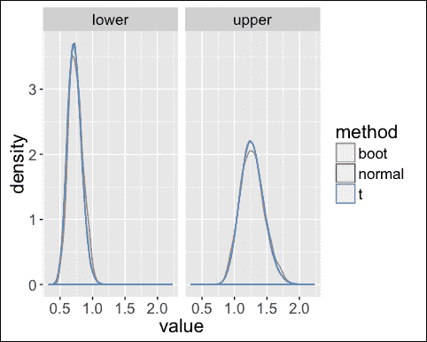

图 10.4:通过模拟三种不同的置信区间估计方法获得的置信下限和置信上限

当谈到偏差和方差，一个估计量最重要的两个属性时，我们总是谈到**均方误差** ( **MSE** )，也参见[第六章](ch06.xhtml "Chapter 6. Probability Theory Shown by Simulation")，*模拟展示的概率理论*。模拟实验估计的均方误差为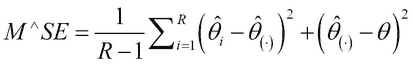 。估计器 2 相对于估计器 1 的相对效率由给出。

我们总结了在这一节中学到的所有知识来进行正态分布总体均值的估计。以下函数包含数据的模拟和估计部分:

```
simMean <- function(simFun = function(x) rnorm(100)){
 ## 1000 samples
 set.seed(123)
 R <- 1000
 m <- list()
 ## 1000 data sets
 for(i in 1:R){
 m[[i]] <- simFun()
 }
 ## estimation
 df <- data.frame("thetahat" = c(sapply(m, mean), sapply(m, mean, trim = 0.1), sapply(m, median), sapply(m, function(x) huberM(x)$mu)), 
 "method" = rep(c("mean","trim","median","huber"), each = R)) 
 ## summary
 vm <- var(df[df$method == "mean", 1])
 df %>% 
 group_by(method) %>% 
 summarize("bias" = mean(thetahat) - 0, 
 "variance" = var(thetahat),
 "mse" = variance + bias^2,
 "re" = vm / var(thetahat))
}

```

我们调用函数来得到不同均值估计的所有结果。我们可以看到，算术平均值是最有效的，具有最小的均方误差:

```
library("robustbase"); library("dplyr")
simMean()
## Source: local data frame [4 x 5]
## 
##   method         bias    variance         mse        re
##   (fctr)        (dbl)       (dbl)       (dbl)     (dbl)
## 1  huber 0.0015911419 0.009542405 0.009544936 0.9474960
## 2   mean 0.0009767488 0.009041390 0.009042344 1.0000000
## 3 median 0.0001103496 0.015578749 0.015578761 0.5803669
## 4   trim 0.0015793808 0.009742862 0.009745357 0.9280014

```

让我们稍微修改一下这个例子。我们可以假设测量误差的存在，并且还可以假设数据是从污染数据的分布中采样的。通常被建模为混合分布，其中表示污染水平，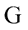是数据中未污染部分的分布，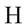是污染的分布。

我们做的基本上和前面提到的一样，但是使用另一个包含 5%异常值的数据生成过程:

```
set.seed(123)
simMean(simFun = function(){c(rnorm(95), rnorm(5,15))})
## Source: local data frame [4 x 5]
## 
##   method       bias    variance        mse        re
##   (fctr)      (dbl)       (dbl)      (dbl)     (dbl)
## 1  huber 0.09645247 0.009946125 0.01924920 0.9090364
## 2   mean 0.75097675 0.009041390 0.57300747 1.0000000
## 3 median 0.06853618 0.016427966 0.02112517 0.5503658
## 4   trim 0.09101656 0.010061782 0.01834580 0.8985874

```

我们可以看到，平均值受这些异常值的影响很大，MSE 远高于 Huber 平均值、修整平均值或中值。因此，在数据集中存在异常值的情况下，对于本例，稳健估计是具有最低均方误差的优选选择。

### 基于模型的模拟研究

在前面的章节中，我们重点介绍了缺失值的插补。此外，在本章中，我们已经展示了一个根据精度误差评估插补方法的例子。

在本节中，我们将再次比较一些插补方法。更准确地说，是基于模型的模拟，将使用成分数据中缺失值的插补示例进行演示。这些示例增强了前面的示例，其主要目的是展示仿真框架和 R 包`simFrame` (Alfons、Templ 和 Filzmoser 2010a)的使用。

根据定义，一个观察值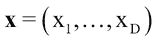是一个 D 部分组合，当且仅当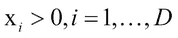，并且所有相关信息都包含在成分之间的比率中(Aitchison 1986)。如果一个观察值乘以一个正常数，信息基本上是相同的，因为组分之间的比率只是感兴趣的。成分数据的示例有:化学分析中的元素浓度、样本材料的家庭支出，或不同支出类别(如住房、食品或休闲活动)的每月家庭支出。

值得注意的是，成分数据在欧几里得空间中没有直接表示，它们的几何形状完全不同，参见 Aitchison 1986。D 部分组合的样本空间称为单纯形，合适的距离度量称为艾奇逊距离(艾奇逊 1992 年)，(艾奇逊等人 2000 年)。幸运的是，存在从 D 维单纯形到真实空间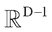的等距变换，这被称为**等距对数比** ( **ilr** )变换(Egozcue et al. 2003)。通过这种变换，艾奇逊距离可以表示为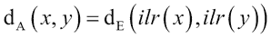，其中

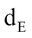

降低欧几里德距离。

Hron、Templ 和 Filzmoser 2010 年介绍了成分数据的插补方法，这些方法在 R 包`robCompositions`中实现(Templ、Hron 和 Filzmoser 2011 年)。虽然软件包侧重于稳健的方法，但在本例中仅使用了经典的插补方法。第一种方法是对**k-最近邻** ( **k-NN** )插补的修改(Troyanskaya 等人，2001 年)，第二种方法遵循基于迭代模型的方法(EM 算法，见第 9 章)，使用**最小二乘** ( **LS** )回归，第三种方法是等于第二种方法，除非使用稳健版本。此外，还比较了在`mice`包中实现的 EM 算法。在执行任何计算之前，加载所需的包，并设置随机数生成器的种子以实现再现性:

```
library("simFrame"); library("robCompositions"); library("mvtnorm"); library("mice")
set.seed(123)

```

本例中的数据由单纯形上的正态分布生成，用表示(Mateu-Figueras、Pawlowsky-Glahn 和 Egozcue 2008)。当且仅当 ilr 变换变量的向量遵循具有均值向量和协方差矩阵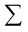的上的多元正态分布时，随机组合遵循该分布。以下命令创建一个控制对象，用于用和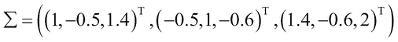生成随机变量的 150 个实现。函数`isomLRinv`与逆等距对数比变换有关。功能`DataControl`允许我们控制数据模拟过程:

```
## data generation
crnorm <- function(n, mean, sigma) data.frame(isomLRinv(rmvnorm(n, mean, sigma)))
sigma <- matrix(c(1, -0.5, 1.4, -0.5, 1, -0.6, 1.4, -0.6, 2), 3, 3)
## data control class
dc <- DataControl(size = 150, distribution = crnorm,
 dots = list(mean = c(0, 2, 3), sigma = sigma))

```

此外，需要创建一个用于插入缺失值的控件对象。在每个变量中，5%的观察值被随机设置为完全缺失:

```
nc <- NAControl(NArate = c(0.05, 0.1))

```

对于两种选定的插补方法，在每次模拟运行中都会计算原始数据和插补的数据之间的相对 Aitchison 距离(参见(Hron、Templ 和 Filzmoser，2010 年)中的模拟研究)。需要注意的是，结果是以向量的形式提供的:

```
sim <- function(x, orig) {
 i <- apply(x, 1, function(x) any(is.na(x)))
 ni <- length(which(i))
 x <- x[, -ncol(x)]
 xMean <- e1071::impute(x)
 xMice <- mice(x, printFlag = FALSE, diagnostics = FALSE, m = 1)
 xMice <- complete(xMice)
 xKNNa <- impKNNa(x)$xImp
 xLS <- impCoda(x, method = "lm")$xImp
 xLTSrob <- impCoda(x, method = "ltsReg")$xImp
 c(xMean = aDist(xMean, orig)/ni,
 xMice = aDist(xMice, orig)/ni,
 knn = aDist(xKNNa, orig)/ni, 
 LS = aDist(xLS, orig)/ni,
 LTSrob = aDist(xLTSrob, orig)/ni)
}

```

然后，可以使用命令`runSimulation`运行模拟，其中所有部分都放在函数参数中——`DataControl`对象、`NAControl`对象和模拟函数，模拟函数实际上包括对评估方法的调用。这里，模拟了 25 个数据集，并将估计量应用于这些数据集:

```
results <- runSimulation(dc,
 nrep = 25,
 NAControl = nc,
 fun = sim)

```

可以使用`head()`、`aggregate(), or simBwplot()`检查结果:

```
aggregate(results)
##   NArate     xMean     xMice      knn        LS    LTSrob
## 1   0.05 17.219489 17.273910 17.26099 17.238508 17.239409
## 2   0.10  9.872175  9.932083  9.91985  9.892985  9.907121

```

*图 10.5* 给出了**模拟**结果的箱线图:

```
simBwplot(results)

```


图 10.5:不同插补方法的模拟结果和比较

由于本例中的插补方法是根据相对距离度量进行评估的，因此越接近 0 的值表示性能越好。数据模拟很容易显示其他方法的差异。

对于现实生活中的情况，也包括异常值是有意义的，因为它们存在于几乎每个数据集中:

```
dcarc <- ContControl(target = c("X1"),
 epsilon = c(0.01,0.03,0.05,0.1),
 dots = list(mean = 150, sd = 1), type = "DCAR")
results <- runSimulation(dc,
 nrep = 3, 
 NAControl = nc, 
 contControl = dcarc,
 fun = sim)
aggregate(results)
##   Epsilon NArate    xMean     xMice       knn        LS    LTSrob
## 1    0.01   0.05 1.169989 0.9501772 0.8440359 0.8873185 0.7044925
## 2    0.03   0.05 1.867719 1.6452466 1.5593942 1.6538767 1.3555124
## 3    0.05   0.05 2.629600 2.5774409 2.4796152 2.6403572 2.1760300
## 4    0.10   0.05 4.180403 4.1640710 4.0308395 4.3412581 3.8326223
## 5    0.01   0.10 1.083472 0.9438792 0.7513994 0.8230325 0.5997533
## 6    0.03   0.10 1.542900 1.4860973 1.1938551 1.4082617 1.0123190
## 7    0.05   0.10 1.790335 1.8517452 1.5830545 1.6937968 1.3795612
## 8    0.10   0.10 2.867004 2.8748454 2.7553507 2.9715110 2.4287011

```

我们将结果绘制在 *图 10.6* 中，以比较模拟结果的分布:

```
simBwplot(results)

```

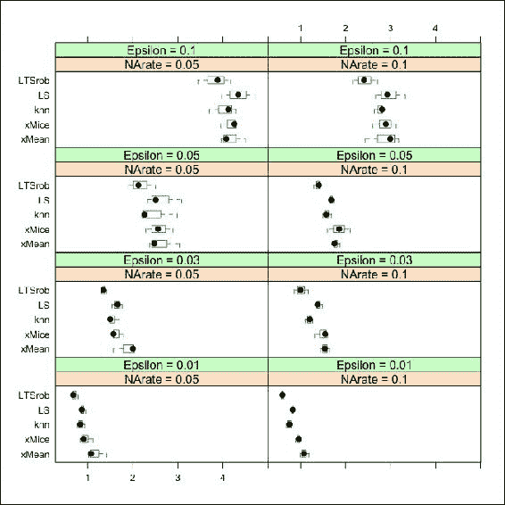

图 10.6:不同插补方法与包含异常值的数据比较的模拟结果

很明显，对于缺失值率和所有污染水平，基于迭代模型的程序在相对艾奇逊距离方面比使用的改进 k-NN 方法产生更好的结果。这并不是一个令人惊讶的结果，因为后者被用作迭代过程的起点。均值插补表现最差，`mice`略差于 Hron、Templ 和 Filzmoser 2010 的 EM 算法。然而，为了认真评估插补方法，还需要考虑其他标准，例如，多变量数据的可变性在多大程度上得到反映；参见 Hron、Templ 和 Filzmoser，2010 年。

我们现在将保持几乎一切不变，进行新的模拟。新的模拟函数现在应该比较协方差而不是距离:

```
sim2 <- function(x, orig) {
 rdcm <- function(x, y){
 ocov <- cov(isomLR(x))
 rcov <- cov(isomLR(y))
 return(frobenius.norm(ocov-rcov)/frobenius.norm(ocov))
 }
 i <- apply(x, 1, function(x) any(is.na(x)))
 ni <- length(which(i))
 x <- x[, -ncol(x)]
 xMean <- e1071::impute(x)
 xMice <- mice(x, printFlag = FALSE, diagnostics = FALSE, m = 1)
 xMice <- complete(xMice)
 xKNNa <- impKNNa(x)$xImp
 xLS <- impCoda(x, method = "lm")$xImp
 xLTSrob <- impCoda(x, method = "ltsReg")$xImp
 c(xMean = rdcm(xMean, orig),
 xMice = rdcm(xMice, orig),
 knn = rdcm(xKNNa, orig), 
 LS = rdcm(xLS, orig),
 LTSrob = rdcm(xLTSrob, orig))
}

```

现在，让我们再次运行模拟:

```
library("matrixcalc")
results <- runSimulation(dc, 
 nrep = 3, 
 NAControl = nc, 
 contControl = dcarc,
 fun = sim2)
aggregate(results)
##   Epsilon NArate     xMean     xMice       knn        LS    LTSrob
## 1    0.01   0.05 0.2052108 0.1888341 0.1677975 0.1746085 0.1581507
## 2    0.03   0.05 0.3707707 0.3556715 0.3447043 0.3607931 0.3407841
## 3    0.05   0.05 0.5094309 0.5009143 0.5082797 0.5075591 0.4938353
## 4    0.10   0.05 0.7008258 0.6825972 0.6809999 0.6860417 0.6658453
## 5    0.01   0.10 0.2284774 0.1783459 0.1741286 0.1849407 0.1621681
## 6    0.03   0.10 0.3847136 0.3726923 0.3477511 0.3749449 0.3424004
## 7    0.05   0.10 0.5484875 0.5096264 0.5148351 0.5428007 0.5106629
## 8    0.10   0.10 0.6914287 0.6790557 0.6846771 0.6876906 0.6677574

```

同样，我们可以看到包`robCompositions`中的鲁棒 EM 方法( *LTSrob* )在此误差测量中表现最佳。


# 基于设计的模拟

当有限抽样框架的统计单位的选择概率不相等时，即当样本是用复杂抽样设计抽取时，基于设计的模拟特别重要。这主要涉及从有限总体中进行的任何抽样，例如，从总体登记中抽取的样本。

如果样本是用某种复杂的抽样设计抽取的，抽样调查的费用可以减少。例如，对于贫困测量，单亲家庭和儿童可能比其他家庭成员更有可能被包括在内，因为单亲家庭很可能是贫困的(基本上是目标*变量*)。

### Tip

基本上，在基于设计的模拟中，使用复杂的采样设计从有限的群体中抽取 R 个样本，其中群体以接近现实的方式被模拟。

对于每个样本，估计总体参数，并将估计值和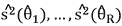与总体参数和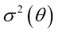进行比较。

## 具有复杂调查数据的示例

每个基于设计的模拟可能会有所不同，这取决于模拟应该显示的目标。然而，一些基本问题保持不变。我们将展示一个非常复杂的基于设计的模拟，其中会出现许多困难。这些困难与异常值、缺失值、不同的抽样设计、要估计的复杂指标及其方差估计有关。

关于社会排斥和贫困的指标是从欧洲联盟收入和生活条件统计数据中估算出来的。

在模拟中，将在人工生成的群体的帮助下进行研究(参见模拟有限群体小节)。样本将从这个群体中抽取。这意味着我们知道将从抽取的样本中估计的参数的真实值。

模拟研究的设计应该非常接近现实。这意味着除了良好的人工总体之外，异常值和缺失值应该在数据中得到很好的定义。例如，缺失值表示问卷中没有回答，异常值表示错误答案。

模拟研究的一般概念也应尽可能接近现实。从人口数据开始，使用现实生活中的抽样方法反复抽取样本。在每次模拟运行中，关注的数量(在大多数情况下，关于社会排斥和贫困的指标或其差异)是从相应的样本中估计出来的。然后将所有模拟运行的结果组合起来形成一个分布。最后，使用某些评估标准将估计值与真实值进行比较。

关于离群值和无响应，对世界最现实的看法是，它们存在于群体层面。一个人是否有极高的收入或不愿意回答调查中的某些问题，并不取决于这个人是否真的在样本中。所以最现实的模拟设计是把污染和无反应插入到种群中。

这种方法的缺点是样本中异常值或缺失值的数量是不可预测的。

如果所考虑的估计量的稳健特性是模拟的主要焦点，或者如果研究了异常值检测方法，则对于彻底的评估来说，最大限度地控制被污染的观察量是必要的。如果不完整数据的处理是主要关注点，那么关于缺失值数量的相同原则也适用。这个问题可以通过将污染和无反应添加到样本而不是群体中来解决。虽然这种方法可能不能真正反映真实的过程，但从统计学家的角度来看，在上述情况下，这种方法可能更实用。然而，应该注意的是，随着模拟运行次数的增加，向样本添加污染和无响应会增加计算成本。*图 10.7* 显示了这种模拟设计的总体轮廓:

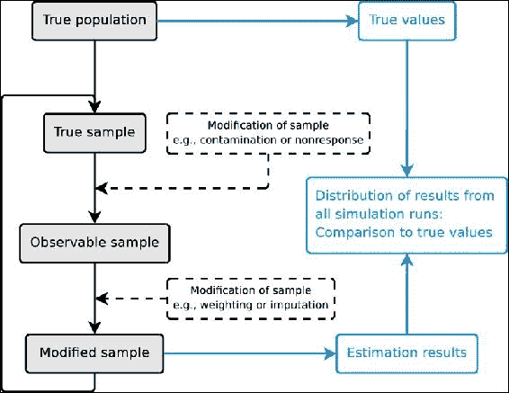

图 10.7:最可行的基于设计的模拟方法的概要

## 模拟合成人口

用 R 包`simPop` (Templ，Kowarik，Meindl 2016)模拟一个种群是最方便的。我们已经部分地展示了如何在前面的章节中使用这个软件来模拟一个群体(一个有限群体模拟的例子)。

我们可以假设这样的群体已经存在，并使用 R 包`simFrame`中可用的群体，用 R 包`simPop`模拟:

```
data("eusilcP")

```

这个群体比真实群体小，但是对于演示问题来说，这是非常合适的。包括以下变量:

```
colnames(eusilcP)
##  [1] "hid"         "region"      "hsize"       "eqsize"      "eqIncome" 
##  [6] "pid"         "id"          "age"         "gender"      "ecoStat" 
## [11] "citizenship" "py010n"      "py050n"      "py090n"      "py100n" 
## [16] "py110n"      "py120n"      "py130n"      "py140n"      "hy040n" 
## [21] "hy050n"      "hy070n"      "hy080n"      "hy090n"      "hy110n" 
## [26] "hy130n"      "hy145n"      "main"

```

有关这些变量的详细信息，请致电`?eusilcP`。

## 感兴趣的估计量

接下来，我们定义感兴趣的估计量。在我们的例子中，这就是基尼系数(Gini 1912)。我们还希望将基尼系数的经典估计值与 Hill 估计值(Hill 1975 年)进行比较，并使用 Alfons、Templ 和 Filzmoser 2013 年提出的稳健加权部分密度分量估计值对基尼系数进行稳健估计。

然后定义每次迭代要运行的函数，我们称之为`sim`。它的参数 k 决定了收入符合帕累托分布的家庭数量。由于`Gini`系数是基于均衡的家庭收入计算的，所以上尾部的家庭中的所有个人都得到相同的值:

```
sim <- function(x, k) {
 require("laeken")
 x <- x[!is.na(x$eqIncome), ]
 ## classical Gini
 g <- gini(x$eqIncome, x$.weight)$value
 ## Hill estimator
 eqIncHill <- fitPareto(x$eqIncome, k = k, method = "thetaHill",
 groups = x$hid)
 gHill <- gini(eqIncHill, x$.weight)$value
 ## partial density component estimator
 eqIncPDC <- fitPareto(x$eqIncome, k = k, method = "thetaPDC",
 groups = x$hid)
 gPDC <- gini(eqIncPDC, x$.weight)$value
 ## results as a vector
 c(standard = g, Hill = gHill, PDC = gPDC) 
}

```

## 定义抽样设计

为了在模拟研究中获得现实生活过程的真实写照，应该使用真实取样方法从总体中抽取样本。还可以使用其他方法来更全面地了解该方法在不同情况下的行为。然而，在关于调查统计的文献中描述了大量的抽样方法，因此有必要选择一些有代表性的方法用于模拟。简单方法对结果的影响可能会提供一些见解，所以应该考虑简单的随机抽样。然而，不等概率抽样在现实中经常使用，应该在模拟中涵盖。由于每个家庭都与 EU-SILC 数据中的一个地区相关联，分层抽样当然应该进行调查。此外，更先进的方法，如多级采样或平衡采样可能是令人感兴趣的。在任何情况下，要测试的设计都应该包括最常用的。

前面定义的函数`sim`在下面的例子中使用，这些例子旨在展示框架的优势。取样设计由以下函数指定:

```
sc <- SampleControl(grouping = "hid", size = 1500, k = 100)

```

在这个基本的模拟设计中，使用简单的随机抽样抽取了 1500 个家庭的 100 个样本。为了从一个模拟设计改变到另一个，我们需要做的就是定义或修改控制对象，并将它们提供给函数`runSimulation()`:

```
library("laeken") # for function gini
set.seed(123)
## run the simulation
results <- runSimulation(eusilcP, sc, fun = sim, k = 175)

```

为了检验仿真结果，实现了几种常用的通用函数的方法。除了`head()`、`tail()`和`summary()`方法外，还有一种使用`aggregate()`计算汇总统计的方法。默认情况下，平均值用作汇总统计数据。此外，`plot()`方法自动选择模拟结果的合适图形表示。因此，也可以添加真实值的参考线:

```
head(results)
##   Run Sample standard     Hill      PDC
## 1   1      1 27.15482 26.68633 26.23039
## 2   2      2 28.00388 28.45642 28.49079
## 3   3      3 26.40009 27.01484 25.72001
## 4   4      4 26.98088 26.80504 26.52683
## 5   5      5 27.08909 27.61471 25.07168
## 6   6      6 27.34760 27.16358 27.94456
aggregate(results)
## standard     Hill      PDC
## 26.72984 26.83082 26.91765

```

*图 10.8* 显示了基本模拟设计的模拟结果的箱线图:

```
tv <- laeken::gini(eusilcP$eqIncome)$value
plot(results, true = tv)

```


图 10.8:(基于设计的)基尼系数估计模拟结果。方法比较

虽然 PDC 估计值具有较大的可变性，但平均而言，所有三种方法都非常接近真实的总体值。这也表明选择适合帕累托分布的家庭数量是合适的。

## 采用分层抽样

官方统计中最常用的抽样设计在`simFrame`中实现。为了切换到另一个采样设计，只需要改变相应的控制对象。在这个例子中，执行了按区域的分层抽样。不同地层的样本大小通过使用控制对象的槽大小的向量来指定:

```
set.seed(12345)
sc <- SampleControl(design = "region", grouping = "hid",
 size = c(75, 250, 250, 125, 200, 225, 125, 150, 100),
 k = 100)
## run new simulation
results <- runSimulation(eusilcP, sc, fun = sim, k = 175)

```

像以前一样，模拟结果由`head()`和`aggregate()`检查。也可以生成模拟结果图(本例中已跳过):

```
head(results)
##   Run Sample standard     Hill      PDC
## 1   1      1 27.08652 27.22293 27.66753
## 2   2      2 26.80670 27.35874 25.93378
## 3   3      3 26.68113 27.03964 26.60062
## 4   4      4 25.84734 26.52346 25.18298
## 5   5      5 26.05449 26.26848 26.60331
## 6   6      6 26.98439 27.01396 26.48090
aggregate(results)
## standard     Hill      PDC
## 26.71792 26.85375 26.86248

```

## 添加污染物

离群值实际上存在于任何数据集中，在离群值存在的情况下评估方法具有很高的兴趣，即研究离群值对估计量的影响。在`simFrame`中，通过定义控制对象来指定污染。因此，在该框架中实现了各种污染模型。请记住，术语“污染”在此处是从技术角度使用的，污染被建模为一个两步过程，另请参见 Beguin 和 Hulliger 2008 年以及 Hulliger 和 Schoch 2009 年。在这个例子中，使用简单的随机抽样选择了 0.5%的家庭受到污染。然后，从平均值为`$\m = 500.000$`且标准差为 s = 10.000 的正态分布中得出选定家庭的均衡收入:

```
set.seed(12345)
## define contamination
cc <- DCARContControl(target = "eqIncome", epsilon = 0.005,
 grouping = "hid", dots = list(mean = 5e+05, sd = 10000))
## run new simulation
results <- runSimulation(eusilcP, sc, contControl = cc, fun = sim, k = 175)

```

再次使用`head()`、`aggregate()`和`plot()`方法查看模拟结果。注意增加了一栏，表明使用的污染等级:

```
head(results)
##   Run Sample Epsilon standard     Hill      PDC
## 1   1      1   0.005 32.71453 29.12110 27.03731
## 2   2      2   0.005 34.22065 31.62709 26.24857
## 3   3      3   0.005 33.56878 28.49760 28.00937
## 4   4      4   0.005 35.26346 29.57160 26.25621
## 5   5      5   0.005 33.79720 29.15945 25.61514
## 6   6      6   0.005 34.72069 28.58610 27.22342
aggregate(results)
##   Epsilon standard     Hill      PDC
## 1   0.005 34.88922 30.26179 27.02093

```

在*图 10.9* 中，给出了最终的箱线图。我们可以看到异常值对希尔和标准估计量的高度影响——对于这些估计量，基尼系数变得任意大:

```
tv <- gini(eusilcP$eqIncome)$value
plot(results, true = tv)

```


图 10.9:(基于设计的)不同方法估计基尼系数的模拟结果，存在一些异常值。灰色垂直线代表基尼系数的已知真实参数值

换句话说，图显示如此少量的污染足以完全破坏基尼系数的标准估计值(以及希尔估计值)。PDC 估计器导致非常精确的结果。

## 在不同的域上分别执行模拟

来自官方统计的数据集通常包含很强的异质性，因此通常也为数据子集计算指标。因此，在模拟研究中调查不同子集上的指示器的行为通常是令人感兴趣的。在`simFrame`中，这可以通过简单地指定函数`runSimulation()`的设计参数来完成。在从上一节扩展示例的情况下，框架然后分割样本，将污染物插入每个子集，并自动调用为这些子集提供的函数:

```
set.seed(12345)
sc <- SampleControl(design = "region", grouping = "hid",
 size = c(75, 250, 250, 125, 200, 225, 125, 150, 100), k = 100)
cc <- DCARContControl(target = "eqIncome", epsilon = 0.005,
 grouping = "hid", dots = list(mean = 5e+05, sd = 10000))
results <- runSimulation(eusilcP, sc, contControl = cc,
 design = "gender", fun = sim, k = 125)

```

使用`head()`和`aggregate()`可以再次检查结果。结果图如图 10.10 所示，显示了每种方法估计的基尼系数的分布。真实参数由灰色垂直线表示:

```
tv <- simSapply(eusilcP, "gender", function(x) gini(x$eqIncome)$value)
plot(results, true = tv)

```

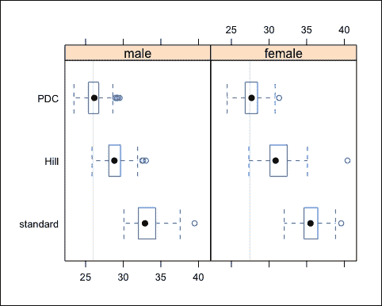

图 10.10:模拟设计的模拟结果，采用分层抽样、污染，并对每个性别分别进行模拟

显然， PDC 估计器使对两个子集都产生了优异的结果，而两种经典方法在两种情况下都受到异常值的严重影响。

为了更全面地了解稳健方法的行为，在模拟研究中通常会调查一个以上的污染水平。对代码唯一必要的修改是使用污染水平的向量作为污染控制对象的槽ε。我们不会讨论这个问题，但可以参考 Alfons、Templ 和 Filzmoser 2010b 了解更多信息。


# 插入缺失值

调查数据几乎总是包含相当数量的缺失值。因此，在接近现实的模拟研究中，需要考虑缺失数据导致的可变性。文献中通常区分三种类型的缺失数据机制。比如，(Little and Rubin 2002): **缺** **完全随机**(**MCAR**)**缺** **随机**(**MAR**)**缺不随机** ( **MNAR** )。

在以下示例中，缺失值被插入到未受 MCAR 污染的家庭的均衡家庭收入中，也就是说，使用简单随机抽样选择其值将被设置为 NA 的家庭。为了比较没有丢失值的方案和有丢失值的方案，使用了 0%和 5%的丢失值比率。样本数量减少到 50 个，并且仅调查 0%、0.5%和 1%的污染水平，以保持该激励示例的计算时间较低。使用`simFrame`，只需要定义缺失数据的控制对象(`NAControl`)并提供给`runSimulation()`，其余的由框架自动完成:

```
set.seed(12345)
sc <- SampleControl(design = "region", grouping = "hid",
 size = c(75, 250, 250, 125, 200, 225, 125, 150, 100), k = 50)
cc <- DCARContControl(target = "eqIncome", epsilon = c(0, 0.005, 0.01), dots = list(mean = 5e+05, sd = 10000))
nc <- NAControl(target = "eqIncome", NArate = c(0, 0.05))
results <- runSimulation(eusilcP, sc, contControl = cc,
 NAControl = nc, design = "gender", fun = sim, k = 125)

```

和往常一样，`head()`、`aggregate()`和`plot()`方法被用来查看模拟结果。需要注意的是，结果中增加了一列，表示使用的缺失值比率，本例中的`aggregate()`为污染水平、缺失值、比率和性别的每个组合返回一个值:

```
aggregate(results)
##    Epsilon NArate gender standard     Hill      PDC
## 1    0.000   0.00   male 25.89948 25.99777 25.74944
## 2    0.005   0.00   male 33.52791 29.30477 26.14659
## 3    0.010   0.00   male 39.45422 32.74672 26.64929
## 4    0.000   0.05   male 25.88434 25.87824 25.80541
## 5    0.005   0.05   male 33.87975 29.60079 26.18759
## 6    0.010   0.05   male 39.99526 33.44462 26.31274
## 7    0.000   0.00 female 27.17769 27.30586 27.19275
## 8    0.005   0.00 female 35.46414 31.37099 27.98622
## 9    0.010   0.00 female 41.28625 35.22113 28.19677
## 10   0.000   0.05 female 27.16026 27.37710 27.20892
## 11   0.005   0.05 female 35.85305 31.56317 27.80455
## 12   0.010   0.05 female 41.86453 35.44025 27.98948

```

我们可以再次看到少数异常值对标准基尼估计量和希尔估计量的影响。如果在模拟研究中使用了多个污染水平和多个缺失值比率，则通过`plot()`方法为模拟结果生成条件图(此处未显示)。


# 总结

本章中显示的模拟有两种不同的类型:基于模型的模拟和基于设计的模拟。基于模型的模拟模拟来自某个(超群体)模型的数据。我们看到基于模型的模拟很容易设置。目标是始终知道真实的参数——在这里，从模拟感兴趣的随机分布的模型中。该估计应用于每个模拟数据，并与真实参数值进行比较。

基于设计的模拟研究的不同之处在于，必须包含取样设计。这就是为什么我们首先展示了如何模拟一个可以从中抽取样本的有限群体。无论何时用简单的随机采样对数据集进行采样，都不需要基于设计的模拟。

我们还展示了包`simFrame`的有效使用。示例表明，该框架允许研究人员仅用几行代码就能利用广泛的模拟设计。为了从一种模拟设计切换到另一种模拟设计，只需要定义或修改控制对象。即使是从基本设计转移到高度复杂的设计，也只需要对代码进行最小的修改。使用这个包可以得到更干净的代码，更少的易错代码，以及更高效的模拟。

## 参考文献

*   艾奇逊，J. 1986。"成分数据的统计分析."伦敦查普曼架构事务所。
*   艾奇逊，J. 1992。"论成分差异的衡量标准."*数学地质*34(4):365–79。
*   艾奇逊、巴尔塞罗-比达尔、马丁-费尔南德斯和帕夫洛斯基-格拉恩。2000."对数比分析和成分距离."*数学地质*32(3):271–75。
*   Alfons，S. Kraft，M. Templ 和 P. Filzmoser。2011."家庭调查中接近真实人口数据的模拟及其在 SILC EU-的应用."*统计方法&应用*20(3):383–407。
*   Alfons，a .，M. Templ 和 P. Filzmoser。2010 年 a。"面向对象的统计模拟框架:R 包 simFrame . "*统计软件杂志*37(3):1–36。http://www.jstatsoft.org/v37/i03/[。](http://www.jstatsoft.org/v37/i03/)
*   ———.2010 年 b。"面向对象的统计模拟框架:R 包 SimFrame . "*统计软件杂志*37(3):1–36。
*   ———.2013."基于帕累托尾部模型的调查样本经济指标的稳健估计."皇家统计学会杂志:C 辑(应用统计学) 62 (2)。布莱克威尔出版有限公司:271–86 页。doi: `10.1111/j.1467-9876.2012.01063.x`。
*   Barrett，C.L .，S. Eubank，A. Marathe，M.V. Marathe，Z. Pan 和 S. Swarup。2011."支持基于模型的政策信息学的信息集成."*创新期刊:公共部门创新期刊* 16 (1)。
*   Barthelemy，j .和 P.L. Toint .2013."没有样本的合成人口生成."*交通运输科学*47(2):266–79。
*   贝克曼，R.J .，K.A .贝格利，和 M.D .麦凯。1996."创建合成基线人口."*交通研究 A 部分:政策与实践*30(6):415–29。
*   贝京，c .和 b .胡里格。2008."不完全调查数据中多元异常值检测的 BACON-EEM 算法."*调查方法*34(1):91–103。
*   布朗 l .和 a .哈丁。2002."社会模型和公共政策:微观模拟模型在澳大利亚的应用."*人工社会与社会模拟杂志* 5 (4): 6。
*   埃戈兹库、j . j . v .帕夫洛斯基-格拉恩、g .马图-菲格拉斯和 c .巴塞洛-比达尔。2003."成分数据分析的等距对数比转换."*数学地质*35(3):279–300。
*   基尼，c。1912."可变性和可变性:对统计分布和关系研究的贡献."*r*的经济法律研究。卡利亚里大学 3:3-159。
*   希尔，1975 年出生。"推断分布尾部的简单通用方法."*统计年鉴*3(5):1163–74。
*   Hron，k .，M. Templ 和 P. Filzmoser。2010."使用经典和稳健方法对成分数据的缺失值进行插补."*计算统计&数据分析*54(12):3095–3107。
*   胡伯，P.J. 1981。稳健的统计数据。威利。
*   胡里格，b .和 t .肖奇。2009."五分股比率的稳健性."*统计新技术*，布鲁塞尔。
*   利特尔、R.J.A .和 D.B .鲁宾。2002.缺失数据的统计分析。第二版。纽约:约翰·威利父子公司。
*   Mateu-Figueras，g .，V. Pawlowsky-Glahn 和 J.J. Egozcue。2008.一些受限样本空间中的正态分布。”[http://arxiv.org/abs/0802.2643](http://arxiv.org/abs/0802.2643)。
*   münnich r .和 J. Schürle。2003.在应用德国微宇宙的情况下对复杂宇宙的模拟。DACSEIS 研究论文系列 4。图宾根大学。
*   Münnich，r .、J. Schürle、W. Bihler、H.-J. Boonstra、P. Knotterus、N. Nieuwenbroek、A. Haslinger 等人，2003 年。欧洲调查的蒙特卡罗模拟研究。DACSEIS 交付成果 D3.1 和 D3.2，图宾根大学。
*   P.J .和 K.van Driessen。1998."最小协方差行列式估计量的快速算法."*技术指标*41:212–23。
*   鲁宾博士，1993 年。"讨论:统计披露限制."*官方统计杂志*9(2):461–68。
*   史密斯博士，J.R .皮尔斯和 k .哈兰。2011.“确定性的空间微观模拟模型能提供可靠的小区域健康行为评估吗？新西兰吸烟盛行的一个例子。”*健康地点*17(2):618–24。
*   斯塔赫尔和麦克勒。2009."评论不变坐标选择."皇家统计学会杂志。
*   斯塔赫尔、麦克勒和其他潜在的人。2013.robustX:“稳健统计的实验功能。”[https://CRAN.R-project.org/package=robustX](https://CRAN.R-project.org/package=robustX)。
*   Templ，m .和 P. Filzmoser。2014."一个合成的接近现实的雇主-雇员群体的模拟和质量."*应用统计学杂志*41(5):1053–72。
*   Templ，m .，K. Hron 和 P. Filzmoser。2011." RobCompositions:一个用于成分数据稳健统计分析的 R 包."*在成分数据分析中*，341–55。约翰·威利&儿子有限公司
*   Templ，m .，A. Kowarik 和 P. Filzmoser。2011."使用标准和稳健方法的迭代逐步回归插补."计算机。统计。数据分析。55(10):2793–2806。
*   templ m . a . kowa rik 和 B. Meindl。2016."合成复数数据的模拟:R-Package SimPop . "*统计软件杂志*，1–39。
*   托明茨，梅勒妮 n，格雷厄姆 p .克拉克和珍妮特 e .里格比。2008.“利兹的吸烟地理:估计个人吸烟率和戒烟服务地点的含义。”第 40 (3)区:341–53。
*   特罗扬斯卡娅、坎托、夏洛克、布朗、哈斯蒂、蒂布拉尼、博茨泰因和奥特曼。2001." DNA 微阵列的缺失值估计方法."*生物信息学*17(6):520–25。
*   威廉姆森 p . g .米切尔和 A. T .麦克唐纳。2002."家庭需水量预测:静态微观模拟方法."*水与环境杂志* 16 (4)。布莱克威尔出版有限公司:243–48 页。