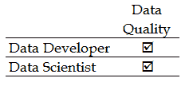
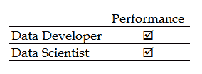
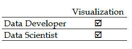
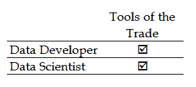

# 一、从数据开发人员过渡到数据科学家

在本章(以及本书的所有章节)中，我们将为您描绘出从像数据开发人员一样思考到像数据科学家一样思考的旅程的起点和继续。

使用开发人员术语和类比，我们将讨论开发人员的目标、典型的开发人员思维方式可能是什么样的、它与数据科学家的思维方式有何不同、为什么两者之间有重要的差异(以及相似之处),并建议如何将自己转变为像数据科学家一样思考。最后，我们将提出理解统计学和数据科学的某些优势，从数据的角度来看，以及像数据科学家一样简单地思考。

在本章中，我们将事情分为以下几个主题:

*   数据开发人员角色的目标
*   数据开发人员如何思考
*   数据开发人员和数据科学家之间的区别
*   像数据科学家一样思考的优势
*   转变为数据科学家心态的步骤

所以，让我们开始吧！

# 数据开发人员思维

戴着数据开发人员的帽子已经很多年了，从这里开始对数据开发人员做一些简短的评论是有意义的。

在某些圈子里，数据库开发人员相当于数据开发人员。但无论是数据还是数据库，两者通常都会被贴上**信息技术** ( **IT** )的专业标签。两人都花时间研究数据和数据库技术。

我们可能会看到更多关注支持和日常维护的数据库(数据)开发人员(如管理员)和更多关注改进、扩展和开发数据访问的开发人员(如开发人员)之间的分歧。

典型的数据开发人员将主要参与创建和维护对数据的访问，而不是消费数据。他或她将在选择用于访问或操作数据的编程语言方面有所投入或可能做出决定。我们将确保新的数据项目遵守数据库如何存储和处理数据的规则，并且我们将在数据源之间创建接口。

此外，一些数据开发人员参与审查和优化其他人编写的查询，因此必须精通最新的优化技术、各种查询语言，如**结构化查询语言** ( **SQL** )，以及如何存储和结构化被访问的数据。

总之，至少从数据开发人员的角度来看，重点是访问有价值的数据资源，而不是消费这些有价值的数据资源。

# 数据开发人员的目标

每个角色、职位或工作岗位都有自己的目标、责任或计划。

因此，在数据开发人员的角色中，可能需要承担以下一些责任:

*   维护数据库和基础设施的完整性
*   监控和优化以保持响应水平
*   确保数据资源的质量和完整性
*   向用户群体提供适当级别的支持
*   对数据资源实现安全策略

作为一名数据科学家，您会注意到有些不同的目标。该角色通常包括以下列出的一些目标:

*   从不同来源挖掘数据
*   识别模式或趋势
*   创建统计模型—建模
*   学习和评估
*   识别见解和预测

你也许注意到了从这里开始的一个主题？

注意关键词:

*   维持
*   监视
*   确保
*   提供
*   执行

这些术语的含义与那些可能与数据科学家的角色更相关的术语不同，例如:

*   采矿
*   趋势
*   建模
*   学问
*   预测

当然，也有一些活动看起来类似于数据开发人员和数据科学家，我们将在这里进行研究。

# 查询或挖掘

作为一名数据开发人员，您几乎总是会有查询数据的习惯。事实上，数据科学家也会查询数据。那么，什么是数据挖掘呢？当一个人查询数据时，他会问一个特定的问题。例如，你可能会问，四月份水仙花的总销量是多少？期望得到一个已知的、相关的答案，比如在四月份，水仙花的销售总数是 269 株。

对于数据挖掘，人们通常更专注于数据关系(或数据点之间的潜在关系，有时称为变量)和认知分析。一个简单的例子可能是:一个月的日平均温度如何影响四月份水仙花的销售总量？

数据查询和数据挖掘之间的另一个重要区别是，查询通常是历史性的，因为它们用于报告过去的结果(四月份的总销售额)，而数据挖掘技术可以是前瞻性的，因为通过使用适当的统计方法，它们可以推断未来的结果或提供结果或事件发生的概率。例如，使用我们前面的例子，当销售区域内的平均温度上升时，我们可能预测水仙花的销售会更高。

# 数据质量或数据清理

你认为数据开发人员会对数据库中的数据质量感兴趣吗？当然，数据开发人员需要关心他们支持或提供访问的数据的质量水平。对于数据开发人员来说，组织内的**数据质量保证** ( **DQA** )过程本质上更加机械，比如确保数据是最新的、完整的，并以正确的格式存储。

通过数据清理，您会看到数据科学家更加强调统计数据质量的概念。这包括使用数据中发现的关系来提高数据质量水平。例如，一个 9 岁的人不应该被标记或显示为美国合法司机组中被错误标记的数据的一部分。

您可能熟悉术语**管理数据**。Munging 有时可以被定义为将不是专门为互操作而设计的系统和接口捆绑在一起的行为。Munging 也可以定义为将原始数据处理或过滤成另一种形式，以满足特定用途或需要。

# 数据建模

数据开发人员根据给定的需求(如将销售交易快速输入组织的在线订单输入系统的能力)，通过与关键利益相关方密切合作来创建数据设计(或模型)。在模型设计期间，有三种数据模型是数据开发人员必须熟悉的——概念的、逻辑的和物理的——每一种都相对独立。

数据科学家创建模型的目的是用数据样本或总体进行训练，以识别以前未知的见解或验证当前的假设。

数据建模可能会变得复杂，因此，经常会看到数据开发和数据建模之间的角色差异。在这些情况下，数据开发人员专注于评估数据本身，创建有意义的报告，而数据建模人员则评估如何收集、维护和使用数据。

# 问题或见解

数据开发人员可能会花费大量时间来监控数据、用户和环境，寻找任何新出现问题的迹象，例如可能导致性能瓶颈或停机的意外使用水平。其他常见职责包括审计、应用程序集成、灾难规划和恢复、容量规划、变更管理、数据库软件版本更新、负载平衡等。

数据科学家花时间评估和分析数据和信息，努力发现有价值的新见解。有希望的是，一旦建立起来，洞察就可以用来做出更好的商业决策。

有一个相关概念要把握；通过使用分析，人们可以识别数据中的模式和趋势，而洞察力是通过使用分析输出获得的值。

# 思维过程

基于解释、过去经验、推理、解决问题、想象和决策的某人的心理程序或认知活动构成了他们的思维方式或思维过程。

人们只能猜测特定的个人实际上会如何思考，或者他们在给定的时间点或在某项活动中的确切想法，或者他们将使用什么样的思维过程来实现他们的目标，但一般来说，数据开发人员可能会花更多的时间来考虑数据的便利性(根据需求提供数据)，而数据科学家则专注于数据消费(总结利用数据的新方法，以发现对现有问题或新机会的见解)。

为了描绘一幅更清晰的画面，你可以用汽车修理工和学校辅导员来类比。

汽车修理工将利用他的技能和适当的工具，使车主可以使用汽车并保持汽车良好运行，或者如果车辆出现问题，修理工将对出现的症状进行诊断并纠正问题。这很像数据开发人员的活动。

在辅导员的帮助下，他或她可能会检查大量关于学生过去表现、个性特征以及经济统计数据的信息，以确定某个特定学生的未来可能存在哪些机会。此外，根据学生个人的资源，可以研究多种情况来预测最佳结果。

显然，上述两个人都提供了有价值的服务，但使用(可能非常)不同的方法和个人思维过程来产生期望的结果。

虽然有一些重叠，但当您是数据开发人员时，您的想法通常是维护对适当数据资源的方便访问，而不是特别关注数据的实质，也就是说，您可能关心数据类型、数据量和可访问性路径，但不关心是否存在认知关系或数据的强大潜在用途。

在下一节中，我们将探索一些简单的情况，努力展示数据开发人员和数据科学家之间的各种对比。

# 开发者对科学家

为了更好地理解数据开发人员和数据科学家之间的区别，让我们花一点时间来考虑几个假设的(但仍然是现实的)情况，这些情况可能会在您的一天中发生。

# 新数据，新来源

当新数据或新数据源变得可用或出现时会发生什么？

在这里，新数据通常意味着更多的当前数据或最新数据已经可用。这方面的一个例子可能是每天早上接收一个最新的月销售交易的文件，通常称为**实际**更新。

在商业世界中，数据可以是真实的(实际的),如经过认证的销售，或者输入到订单处理系统中的销售交易，或者是假设的，如组织预测未来(尚未实际发生的)销售或交易。

您可能会定期从在线交易处理系统接收数据文件，该系统提供从每月第一天到当前日期的每日销售额或销售数字。您希望您的业务报告显示包括最近销售交易的总销售额。

新数据源的概念是不同的。如果我们使用与之前相同的类比，一个例子可能是母公司新收购的一家公司的销售交易文件。也许另一个例子是接收报告最近在线调查结果的数据。这是出于特定目的收集的信息，通常不是(但可能是)常规事件。

就在你读这篇文章的时候，机器(和其他)数据正在积累，提供了新的有趣的数据源，为消费数据创造了市场。一个有趣的例子可能是亚马逊网络服务([https://aws.amazon.com/datasets/](https://aws.amazon.com/datasets/))。在这里，你可以找到大量的公共数据资源，包括 *1000 基因组项目*(试图建立最全面的人类基因信息数据库)以及美国宇航局的地球卫星图像数据库。

在前面的场景中，数据开发人员很可能(应该)期待更新的文件，并且已经实现了**提取**、**转换**和**加载** ( **ETL** )过程来自动处理数据，处理任何异常，并确保所有适当的报告反映最新的、正确的信息。数据开发人员还将处理从新收购的公司转换销售文件，但可能不是处理调查结果(或 *1000 基因组项目*)的主要资源。

数据科学家不参与数据的日常处理(如销售)，但将直接负责调查结果项目。也就是说，数据科学家几乎总是亲力亲为，例如为涉及测量的项目研究和获取新的信息源。数据科学家最有可能在调查的设计中提供意见，因为他们将在分析中使用这些数据。

# 质量问题

假设有人担心组织将要使用或正在使用的数据的质量。正如我们在本章前面所回避的，有不同类型的数据质量问题，比如我们所说的**机械问题**以及**统计问题**(还有其他问题)。

最常见的统计质量问题的当前趋势示例包括重复条目和拼写错误、错误分类和汇总以及含义变化。

如果管理层对每日报告中列出的总销售额的有效性提出质疑，或者可能因为您的大多数客户在美国不能合法驾驶而不信任它，那么组织的回头客数量正在下降，您就遇到了质量问题:

质量是数据开发人员和数据科学家共同关心的问题。数据开发人员更关注时间和格式(数据的机制)，而数据科学家对数据的统计质量更感兴趣(优先考虑可能影响特定研究可靠性的数据问题)。

# 查询和挖掘

历史上，信息技术组或部门已经被各种各样的商业用户恳求产生和提供显示存储在感兴趣的数据库和系统中的信息的报告。

这些特别的报告请求已经发展成为对按需原始数据提取(而不是格式化或漂亮打印的报告)的请求，以便业务用户可以将提取的数据导入到 MS Excel(或其他)等工具中，然后他们可以执行自己的格式化和报告，或者执行进一步的分析和建模。在当今世界，业务用户需要更多的自助服务(甚至移动)能力来满足其组织(或个人)的分析和报告需求，希望能够直接或通过更小的、面向焦点的数据池访问更新的原始数据存储。

如果业务应用程序不能自己提供必要的报告，业务用户通常会继续他们的自助服务之旅。
——克里斯蒂娜·黄([www.datainformed.com](http://www.datainformed.com)

根据特定的按需需求创建临时报告和执行提取，或者提供对数据的自助访问，这完全是组织的数据开发人员的职责。但是，请注意，数据科学家会希望定期执行自己的查询和提取，这通常是他们正在进行的项目的一部分。他们可以使用这些查询结果来确定他们需要的数据的可行性和可用性，或者作为为特定统计项目创建抽样或总体的过程的一部分。这种形式的查询可以被认为是数据挖掘的一种形式，比查询更深入数据。这项工作通常由数据科学家而不是数据开发人员来完成。

# 表演

你可以打赌，几乎每个人都在或者将要关注性能这个话题。某些形式的(性能)可能更容易量化，例如完成特定查询或提取的可接受响应时间是多少？或者输入一个销售订单需要点击鼠标或击键的总数是多少？其他问题可能更难回答或解决，例如为什么回头客的数量似乎有下降的趋势？

数据开发人员的责任是创建和支持数据设计(甚至包括基础设施配置选项),这些数据设计始终能产生快速的响应时间，并且易于理解和使用。

一个可能令人困惑的绩效责任领域是网站绩效领域。例如，如果一个组织的网站表现不佳，是因为某些页面加载缓慢或不感兴趣和/或与目标受众或客户无关吗？在这个例子中，数据开发人员和数据科学家都可以被指示解决这个问题。

这些个人——数据开发人员——不会参与调查项目。另一方面，数据科学家将不会参与日常事务(或类似的)绩效问题，但将是与组织的利益相关者合作的主要负责人，通过定义和领导统计项目，努力回答类似关于重复客户计数的问题。

# 财务报表

在每个组织中，都需要定期编制财务报表(如损益表、资产负债表或现金流量表)。财务报告(或 Fin 报告)旨在回答与业务相关的关键问题，例如:

*   我们是盈利还是亏损？
*   资产与负债相比如何？
*   我们有或需要多少自由现金？

创建、更新和验证定期财务报表的过程对于任何规模的企业(无论是盈利还是非盈利企业，无论是公有还是私有)来说都是一项强制性任务。时至今日，组织并没有全部使用全自动报告解决方案。这意味着，即使是用最新数据更新一份报告的任务也可能是一场令人生畏的考验。

就责任而言，财务报告是业内定义(相当)明确的一个领域。数据开发人员将创建和支持使数据可用的处理和系统，确保数据的正确性，甚至(在某些情况下)创建和分发报告。

*Over 83 percent of businesses in the world today utilize MS Excel for Month End close and reporting* *-[https://venasolutions.com/](https://venasolutions.com/)*

通常情况下，数据开发人员会提供和维护数据来支持这些工作。

数据科学家通常不支持组织的日常处理和(财务)报告工作。然而，数据科学家将对生成的财务信息(和支持数据)进行分析，以生成报告和可视化，表明对盈利能力、效率和风险(仅举几例)方面的管理绩效的见解。

统计学和数据科学的一个特别有趣的领域是，当数据科学家执行垂直分析以确定变量与组织财务报表中的基数之间的关系时。

# 肉眼观察

如今，以仪表板格式生成可视化效果是一种常见的做法，这种可视化效果可以显示更新后的各个关键绩效指标 ( **KPI** )。此外，交流某个特定点或简化堆积如山的数据的复杂性并不需要使用数据可视化技术，但在某些方面，当今世界可能需要它。

大多数人可能会同意，扫描大量的工作表、电子表格或报告是平凡而乏味的，而查看图表和图形(如可视化)通常会容易得多。就这一点而言，数据开发人员和数据科学家同样会设计、创建和使用数据可视化。这种差异将在创建的可视化类型中发现。数据开发人员通常专注于重复数据点的可视化(举个常见的例子，预测与实际)，而数据科学家使用可视化作为统计项目的一部分。

同样，数据开发人员最有可能利用可视化来说明或突出显示，例如，一年中逐月的销售量，而数据科学家可能使用可视化来预测明年逐月的潜在销售量，给定季节性(和其他)统计数据。

# 贸易工具

个人用来访问和使用数据的工具和技术可能会因各种因素而有很大差异，例如:

*   企业的类型
*   业务问题(或机会)的类型
*   安全或法律要求
*   硬件和软件兼容性和/或先决条件
*   数据的类型和用途
*   用户社区的细节
*   公司政策
*   价格

在不断变化的技术环境中，数据开发人员和数据科学家拥有越来越多，甚至是压倒性的选择，包括非常可行的开源选项。

开源软件是由用户群体开发的软件，也是为用户群体开发的软件。好消息是，开源软件在今天的绝大多数，或者说 78%的全球企业中使用——沃恩-尼科尔斯，[http://www.zdnet.com/](http://www.zdnet.com/)。开源在数据科学中一直扮演着重要的角色。

当我们谈论工具和技术时，数据开发人员和数据科学家都将平等地参与选择最适合他们个人喜好和厌恶并满足项目或目标要求的正确工具或技术。

# 像数据科学家一样思考的优势

那么，作为一名数据开发人员，为什么要努力像(或更像)数据科学家那样思考呢？理解统计的方法和途径有什么意义？具体来说，像数据科学家一样思考的优势可能是什么？

以下是支持向数据科学发展的几个概念:

*   开发理解数据的更好方法
*   在程序或数据库设计过程中运用统计思维
*   添加到您的个人工具箱
*   增加的适销性
*   永久学习
*   看到未来

# 开发理解数据的更好方法

无论您是数据开发人员、系统分析师、程序员/开发人员、数据科学家，还是其他业务或技术专业人员，您都需要能够与您正在处理的数据或为其设计应用程序或数据库模式的数据建立全面的关系。

有些人可能依赖于作为整个项目计划或需求的一部分提供给您的数据规范，而有些人(通常是那些有更多经验的人)可能通过对数据执行一些通用查询来补充他们的理解，无论哪种方式，这很少是足够的。

事实上，在行业案例研究中，不清楚的、被误解的或不完整的需求或规范一直是项目失败或增加风险的前五大原因。

分析数据是一个过程，是数据科学的特征，旨在建立数据亲密度(或对数据及其内在关系的更清晰和简明的理解)。概要分析数据还建立了上下文，其中有几个通用的上下文类别，可用于增加或提高任何目的或项目的数据的价值和理解。

这些类别包括以下内容:

*   **定义和解释**:这些有助于获得关于数据中数据点的附加信息或属性
*   **比较**:这有助于向数据中的数据点添加可比较的值
*   **对比**:这有助于给一个数据点添加一个对立面，看它是否可能决定一个不同的视角
*   **趋势**:这些是典型的数学计算、总结或汇总
*   **分散**:这包括数学计算(或总结)，如范围、方差和标准偏差，描述数据集(或数据组)的平均值

可以将数据分析看作是您可能用来检查数据文件中的数据并收集有关该数据的统计信息和信息的过程。这些统计数据很可能驱动程序中实现的逻辑，或者如何关联数据库表中的数据。

# 在程序或数据库设计中使用统计思维

创建数据库设计的过程通常包括由数据库设计人员(或数据开发人员)执行的几项任务。通常，设计师将执行以下操作:

1.  确定哪些数据将保存在数据库中。
2.  建立不同数据点之间的关系。
3.  根据步骤 1 和 2 创建一个逻辑数据结构。

即使在应用程序设计过程中，对数据如何工作的透彻理解也是必不可少的。如果不了解平均值或默认值、数据点和分组之间的关系等等，创建的应用程序就有失败的风险。

应用统计思维来帮助数据设计的一个想法是在真实数据有限的情况下。如果无法收集到足够的数据，可以通过各种采样方法(如概率采样)来创建样本(测试)数据。

基于概率的样本是通过构建一个目标总体值的列表来创建的，称为**样本框架**，然后是从样本框架中选择记录的随机过程，称为**选择过程**。可以把这想象成创建一个脚本，根据您对实际数据的了解以及一些用于测试您的设计的统计逻辑来生成样本数据的记录。

最后，用科学或统计方法处理任何问题，你很可能会得到更好的结果。

# 添加到您的个人工具箱

根据我的经验，大多数数据开发人员倾向于锁定一种技术或工具，这是基于各种因素(其中一些我们在本章前面提到过)对产品、工具或技术越来越熟悉和(希望)越来越精通——甚至是不断发布的新版本。有人可能会怀疑(可能是正确的)开发人员使用工具越多，他或她建立的技能水平就越高。然而，数据科学家似乎更关注方法、实践或概念，而不是他们用来实现它们的实际工具和技术。

这种焦点的转移(从工具到技术)改变了一个人的心态，即思考什么工具最适合我的目标，而不是这个工具如何适合我的目标。

你接触的工具越多，你的思维就会越宽广，成为一个开发者或者数据科学家。开源社区提供了优秀的工具，您可以免费下载、学习和使用。一个人应该对下一步或新的学习有一个心态，即使是试图比较一个新工具和你喜欢的工具的特性和功能。我们将在本章的“永久学习”部分详细讨论这一点。

当前流行的数据开发人员或数据使能工具的一个令人兴奋的例子是**MarkLogic**(【http://www.marklogic.com/】T2)。这是一个操作性和事务性企业 NoSQL 数据库，旨在集成、存储、管理和搜索比以往更多的数据。MarkLogic 获得了 2017 年戴维斯最佳数据开发工具奖。r 和 Python 似乎是数据科学家的首选。

在结束本节之前，不提及 IBM Watson Analytics([https://www.ibm.com/watson/](https://www.ibm.com/watson/))是不合适的，该公司目前正在改变行业对统计或认知思维的看法。

# 增加的适销性

数据科学显然是一个不断发展的领域，越来越受欢迎。事实上，我猜想，如果你问十几个专业人士，你很可能会得到十几个关于什么是数据科学家(以及他们在项目或组织中的位置)的不同定义，但最有可能的是，所有人都会同意他们的重要性，以及当今行业和世界存在大量的机会。

数据科学家面临着对更多模型、更多见解前所未有的需求...只有一种方法可以做到这一点:他们必须大幅加快洞察到行动的速度。未来的数据科学家，必须变得更有生产力。这是他们从数据中获取更多价值的唯一途径。
-瓜尔蒂耶里 [https://www . datanami . com/2015/09/18/the-future-of-data-science/](https://www.datanami.com/2015/09/18/the-future-of-data-science/)

如今，数据科学家相对难找。如果你做你的研究，你会发现今天的数据科学家可能有一个混合的背景，包括数学，编程，软件设计，实验设计，工程，沟通和管理技能。在实践中，你会发现你找到的大多数数据科学家都不是某一方面的专家，而是在几个领域或背景中拥有不同水平的熟练程度。

自 1200 多年前的统计领域以来，数据科学家的角色已经发生了明确的演变。尽管这个词在本世纪初才出现，但它已经被评为 21 世纪最性感的工作，可以理解的是，这使得申请人排起了长队
-皮尔森
[https://www . LinkedIn . com/pulse/evolution-data-scientist-Chris-皮尔森](https://www.linkedin.com/pulse/evolution-data-scientist-chris-pearson)

目前，还没有官方的数据科学家职位描述(或先决条件列表)。这为您提供了创建自己风格的数据科学家的机会，以新的方式为您的组织提供价值。

# 永久学习

持续评估或永久学习的概念是一个需要掌握的重要统计概念。把学习感知的提升技能看作一个普遍的定义。比如统计学，可以参考交叉验证的思路。这是一种测量(评估)统计模型性能的统计方法。本实践包括确定一组验证值，然后运行一个模型一组轮次(连续)，使用样本数据集，然后平均每个轮次的结果，以最终查看模型(或方法)在解决特定问题或满足目标方面的表现。

这里的期望是，在给定性能结果的情况下，可以对模型进行调整，以便在使用真实或完整的数据时提供识别洞察力的能力。这个概念不仅是数据开发人员应该用来提炼或微调数据设计或数据驱动的应用程序流程的实践，而且是以尝试、学习、调整和重复的形式给出的很好的生活建议。

模型评估的想法不是统计学独有的。数据开发人员可能会认为这类似于预测 SQL 性能的行为，或者可能是应用程序演练的实践，其中应用程序根据其记录的需求中陈述的意图和目的进行验证。

# 看到未来

预测建模使用数据科学的统计数据来预测或预见一个结果(实际上是一个可能的结果)。这听起来可能很像算命，但它更像是运用认知推理来解释信息(从数据中挖掘)以得出结论。科学家可能被描述为以有条不紊的方式行事、试图获取知识或学习的人，而数据科学家可能被认为是试图使用统计数据和(机器)学习来进行预测。

当我们谈论预测一个结果时，它实际上完全是关于看到某个结果的概率。概率涉及预测未来事件发生的可能性，而统计学涉及对过去事件发生频率的分析。

如果您是一名数据开发人员，并且可能参与过为某个组织的财务办公室服务的项目，您可能会理解为什么企业领导会发现不仅报告其财务结果(即使最准确的结果实际上仍然是历史事件)而且能够对未来绩效做出有根据的假设是有价值的。

也许你可以理解，如果你有财务报告的背景并负责财务报告，你现在可以向这些报告提供统计预测迈出一步！

统计建模技术还可以应用于任何类型的未知事件，而不管它何时发生，例如在犯罪侦查和嫌疑人识别的情况下。

# 向数据科学家转型

在本节开始时，我们先花点时间陈述一下我认为的关于向数据科学家过渡的一些普遍接受的事实。我们将在本书中继续重申这些信念:

*   学术界:数据科学家并不都来自一个学术背景。并不都是计算机科学或者统计/数学专业的。他们并不都拥有高等学位(事实上，你可以用学士学位或更低的学位来使用统计学和数据科学)。
*   它不是基于魔法的:数据科学家可以使用机器学习和其他公认的统计方法来从数据中识别见解，而不是魔法。
*   他们并不都是技术或计算机极客:你不需要多年的编程经验或昂贵的统计软件就能有效。
*   不需要有经验就能上手。你可以从今天开始，现在就开始。(嗯，你买这本书的时候就已经有了！)

好了，做了前面的声明，让我们也现实一点。和往常一样，生活中的每一件事都有一个切入点，并且，给予它应有的信任，你能从一开始就获得的证书越多，你很可能会变得越好。尽管如此，(正如我们将在本章后面看到的)，绝对没有正当的理由为什么你不能立即开始理解、使用数据科学和统计学并提高其生产力。

和任何职业一样，证书和学位承载着打开大门的重量，而经验一如既往地被认为是最好的老师。然而，没有虚假的数据科学家，只有那些目前渴望多于实际经验的科学家。

如果你不仅对理解统计和数据科学非常感兴趣，而且最终想成为一名全职数据科学家，那么你应该考虑将以下常见主题(你可能会在数据科学家的招聘信息中找到)作为重点关注的领域:

*   教育:通常的学习领域是数学和统计学，其次是计算机科学和工程(还有经济学和运筹学)。还是那句话，没有严格要求必须有高等学位，甚至相关学位。此外，通常，学位或同等经验的概念也适用于此。
*   **技术**:您会听到 SAS 和 R(实际上，您会听到很多关于 R 的内容)以及 Python、Hadoop 和 SQL 被认为是数据科学家熟悉的关键或首选，但是工具和技术一直在变化，因此，正如本章多次提到的，数据开发人员只要理解了数据科学的目标和各种统计神话，就可以开始提高工作效率，而不必学习新的工具或语言。

Omniture、Google Analytics、SPSS、Excel 或任何其他 Microsoft Office 工具等基本业务技能几乎随处可见，并不算是优势，但编程语言(如 Java、PERL 或 C++)或数据库(如 MySQL、NoSQL、Oracle 等)经验除外。)确实有帮助！

*   **数据**:理解数据和应对各种数据类型特有挑战的能力，例如非结构化数据、机器生成数据和大数据(包括组织和结构化大型数据集)。

非结构化数据是统计学和数据科学家感兴趣的一个关键领域。它通常被描述为没有为其定义的重新定义的模型或者没有以预定义的方式组织的数据。非结构化信息的特点是以文本为主，但也可能包含日期、数字和各种其他事实。

*   求知欲:我喜欢这个。如果你想成为一名数据科学家，这或许可以被很好地定义为一种便利的性格特征(如果不是必需的话)。这意味着你有持续的需求去了解比基础知识更多的东西，或者想要超越关于一个主题的常识(你不需要一个挂在墙上的学位！)
*   **商业敏锐度**:要成为一名数据开发人员或数据科学家，你需要对你所在的行业有深刻的理解，你还需要知道你的组织需要解决哪些业务问题。就数据科学而言，除了确定企业应利用其数据的新方式之外，能够辨别哪些问题最需要解决也至关重要。
*   沟通技巧:所有公司都在寻找能够清晰流利地将他们的发现翻译给非技术团队的人，比如营销或销售部门。作为一名数据科学家，除了了解他们的非技术同事增加价值和取得成功的需求之外，还必须能够通过向他们提供量化的见解来帮助他们制定决策。

# 让我们继续前进

所以，让我们用一些随意的(如果不是常识的话)建议来结束这一章，这些建议是给想要学习统计学并过渡到数据科学领域的数据开发人员的。

以下是一些建议，您应该将其作为熟悉统计和数据科学主题的参考资料:

*   **书籍**:还是最好的学习方式！你可以从书中获得非常实用和详细的信息(有例子)和建议。你从这本书开始很好，但是还有数量惊人(并且一直在增长)的书面资源等着你去消费。
*   谷歌:我非常喜欢做互联网研究。你会对开源软件的数量和质量感到惊讶，另外，你可以在那里找到自由软件库、实用程序、模型、样本数据、白皮书、博客等等。很多都可以下载并直接用于教育你，甚至作为一个实际项目或交付的一部分。
*   LinkedIn :很大比例的公司和独立招聘人员使用社交媒体，大多数人使用 LinkedIn。这是一个机会，看看什么类型的职位是需要的，以及他们到底需要什么样的技能和经验。当你看到一些你不认识的东西时，做一些研究来教育你自己。此外，LinkedIn 有大量专注于统计和数据科学的小组。加入他们所有人！与会员交流，甚至直接问他们问题。在大多数情况下，社区很乐意帮助你(即使只是为了显示他们知道多少)。
*   志愿服务:志愿服务是培养技能、继续学习和拓展你的统计网络的一个好方法。如果你报名成为志愿者，去 http://www.datakind.org/get-involved.看看，他们会检查你的技能，并与适合你背景或你感兴趣的项目保持联系。
*   实习:有经验的专业人士可能会被重新招募为实习生，以测试一个新的职业或进入一个新的行业(www。wet foots . com)。虽然对于除了刚毕业的大学生之外的任何人来说都不现实，但如果你能负担得起减薪(甚至无薪)一段时间，以获得一些统计和数据科学方面的实践经验，实习是可行的。更实际的做法可能是在你自己的公司实习一段时间，作为一名数据科学家学徒，或者为一个特定的项目实习。
*   **边项目**:这是我的最爱之一。在你的组织中寻找可能会用到统计数据的机会，在你空闲的时候要求参加会议或参加电话会议。如果这是不可能的，寻找统计学和数据科学可能解决问题或解决问题的场景，并让它成为你在业余时间从事的一个宠物项目。这类项目风险低，因为没有截止日期，如果一开始没有成功，也不是世界末日。
*   **数据**:帮助您过渡到统计学和数据科学的最简单的方法之一，可能就是接触更多类型的数据，尤其是非结构化数据和大数据。此外，探索来自其他行业或应用程序的数据总是很有帮助的。
*   Coursera 和 **Kaggle** : Coursera 是一个在线网站，你可以付费参加**大规模在线开放课程** ( **MOOCs** )课程并获得认证，而 Kaggle 则举办数据科学竞赛，你不仅可以在与其他成员的竞争中评估自己的能力，还可以访问大型、非结构化的大数据文件，这些文件可能更像你可能在实际统计项目中使用的文件。
*   多样化:为了增加你的分析技能的可信度(因为许多公司每天都在采用大量的新工具),比如 R、Python、SAS、Scala(当然还有 SQL)等等，如果你花时间获取尽可能多的工具和技术的知识，你将会有很大的优势。除了这些主流数据科学工具，您可能还想研究一些新兴工具，如 Paxada、MatLab、Trifacta、Google Cloud Prediction API 或 Logical Glue。
*   **询问招聘人员**:在你转型的早期花时间与招聘人员发展关系会带来很多好处，但是一个值得信任的招聘人员可以传递一份目前需要的技能清单，以及哪些统计实践最受欢迎。此外，随着你获得经验和信心，招聘人员可以帮助你专注于或调整你的经验，以获得可能更远的特定机会，这可能会让你比其他候选人更有优势。
*   在线视频:查看 YouTube 上的网络研讨会和 how to 视频。业余爱好者和专业人士有无穷无尽的资源，只要你的时间表允许，你都可以查看。

# 摘要

在这一章中，我们通过使用各种实际的例子，比较了数据开发人员和数据科学家的思维模式，勾勒出了数据库(或数据)开发人员如何在日常解决问题的基础上进行思考。

我们还列出了作为数据科学家思考的一些优势，最后讨论了一些常见主题，供您在了解统计学并过渡到数据科学领域时关注。

在下一章中，我们将介绍和解释(再次从开发人员的角度)数据科学统计学背后的基本目标，并向您介绍整本书中使用的重要术语和关键概念(带有易于理解的解释和示例)。