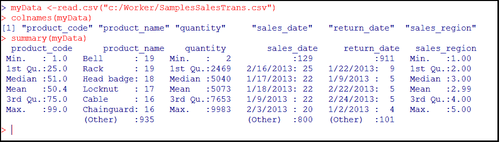
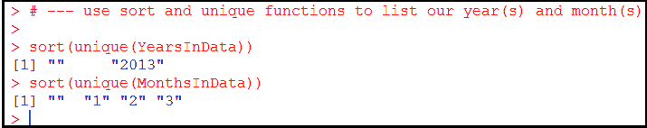
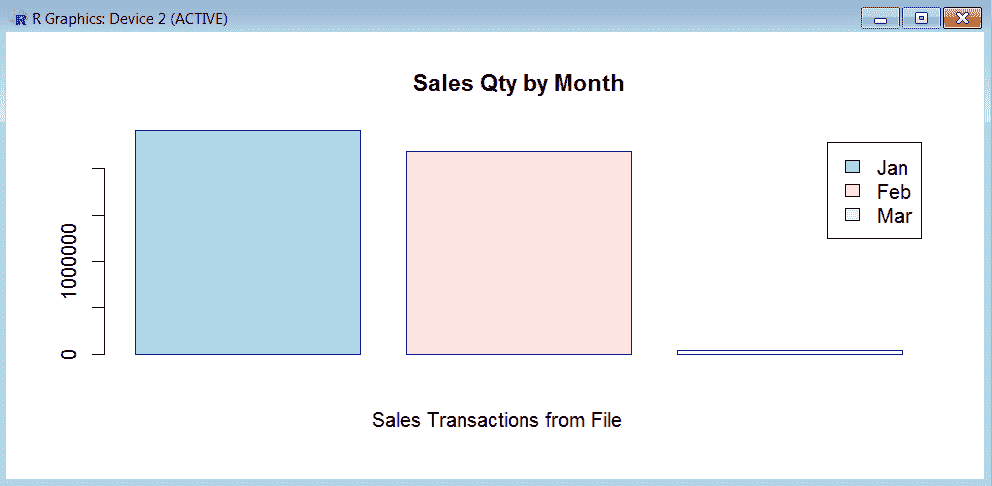
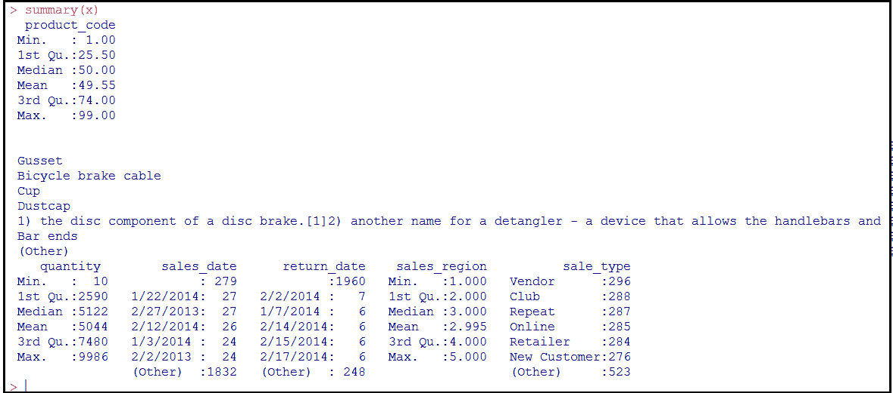
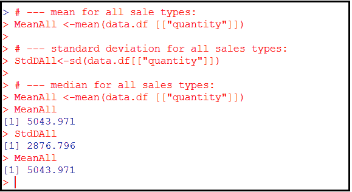
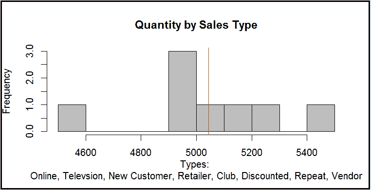
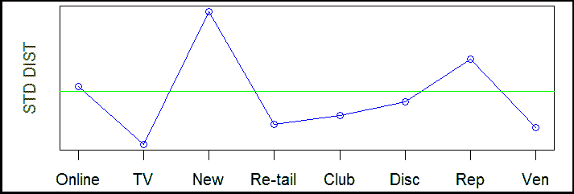
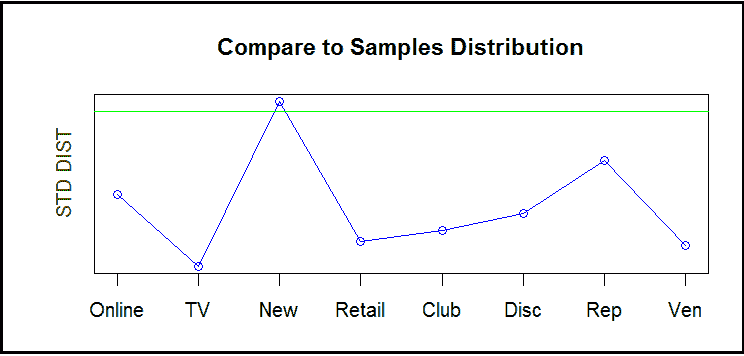
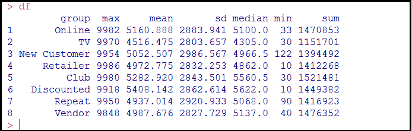
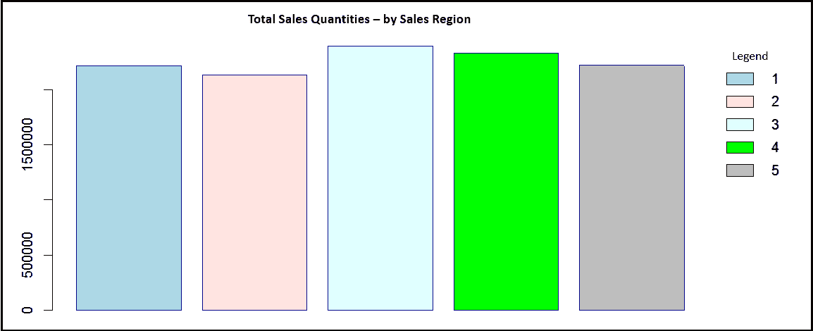

# 五、数据库开发人员的统计分析

本章向数据开发人员介绍统计分析的实践。

作为一名数据开发人员，数据分析的概念或流程你可能很清楚。然而，尽管数据分析的艺术和统计分析的艺术之间碰巧有相似之处，但也有需要理解的重要差异。

在这一章中，我们旨在指出分析类型之间的相似性和差异，帮助读者理解描述成功的统计分析工作中发现的关键因素或特征的数据、汇总和统计分析过程的基本原理，并提供成功的数据统计分析所需的每个步骤的工作示例。

在本章中，我们将事情分为以下几个主题:

*   什么是数据分析、统计分析、总结？
*   成功的数据统计分析的步骤
*   使用 R 对数据进行统计分析
*   示例-总结模型


# 数据分析

让我们先来看看什么叫做**数据分析**。这被定义为使用分析和逻辑推理评估数据的结构化过程。执行数据分析的方法是花时间收集所有要分析的数据，将这些数据(现在被视为数据源)分成块或组件(可以查看)，然后根据数据中看到或发现的内容得出结论。通常，这样做是为了确定数据源可用于满足已声明的项目可交付性。

有各种具体的数据分析方法，其中一些包括数据挖掘(在[第 4 章](a09a76f2-4d2d-4623-9eb4-be4925cf592d.xhtml)、*数据挖掘和数据库开发人员*中讨论)、文本分析、商业智能和数据可视化(仅举几例)。

对于数据开发人员来说，数据分析包括带着某种意图检查数据源的各个部分。

例如，假设我们从一个自行车制造组织收集了一些交易数据，我们希望潜在地将这些数据用于销售业绩报告交付件。典型的这种类型的项目，让我们说，我们已经提供了从 CSV 格式的数据库中提取的数据。

现在，使用 R 命令，我们可以识别数据中的字段或列，并查看总结。下面的 R 代码使用`read.csv`将我们的数据文件加载到 R 数据框对象中，然后使用命令`colnames`列出在我们的文件中找到的字段或列名；然后，我们最后使用 R 命令摘要来指示 R 为我们提供一些关于数据的统计信息。

下面的屏幕截图显示了运行 R 命令(`colnames`和`summary`)的输出:



# 仔细看

一旦我们确定我们的数据包括产品标识符(编号和名称)、交易数量、销售日期、退货日期、销售区域信息等等，我们将希望对数据中发现的组件进行一些探索(分析)。或许，我们可以通过使用 R 命令`nrow`在我们的文件中建立记录总数来开始这项工作，然后使用 R 命令`list`和`unique,`列出我们的数据中存在的唯一零件或产品编号，如下面的代码和部分输出所示:


进一步的数据分析任务将包括检查数据中发现的每个组件，例如:

*   在`sales_date`和`return_date`(组件)字段中找到的日期值的格式是什么？
*   这些字段中的日期范围是什么？
*   我们的数据文件中包含多少独特的产品和销售区域？

请记住，日期总是棘手的，因此在任何包含日期或时间值的数据分析中，确定格式和范围始终是一项有价值的分析工作。

为了举例说明，让我们使用几个简单的 R 命令来创建一个在我们的数据中找到的年份和月份的列表。

下面是用来完成这个统计分析任务的 R 代码:

```r
# --- read our data file into "x" 
x <-read.table("c:/Worker/23SamplesSalesTrans.csv", sep=",", header = FALSE, skip = 1) 
# --- convert "x" into a data frame object, then set the data frame to 
# --- hold only the sales_date  
data.df <- data.frame(x) 
data.df <- data.df[,4] 
# --- use the R commands substr and regexpr to strip out just the year and # --- month from the sales date field  
YearsInData = substr(substr(data.df[],(regexpr('/',data.df[])+1),11),( regexpr('/',substr(data.df[],(regexpr('/',data.df[])+1),11))+1),11) 
MonthsInData = substr(data.df[],(regexpr('/',data.df[])-1),1) 
# --- use sort and unique functions to list our year(s) and month(s) 
sort(unique(YearsInData)) 
sort(unique(MonthsInData)) 
```

以下屏幕截图显示了运行前面命令的输出:



我们可以看到，我们的数据只包含日历年`2013`的第一季度、月份`1`、`2`和`3`的信息。现在我们已经建立了数据的时间序列。仍然有大量的数据分析工作可以完成，但关键是我们正在进行旨在建立结构的分析练习，以便我们可以满足销售业绩报告的原始目标，而不是任何机器学习。

记住这一点，让我们假设我们想按月检查交易量。要做到这一点，我们可以使用 R 来计算这些每月总额，使用以下 R 代码:

```r
# --- read data 
data.df<-data.frame(x) 
# --- initialize counters 
JanuarySales <-0 
FebruarySales <-0 
MarchSales <-0 
# --- loop and count 
for(i in 1:nrow(data.df)) 
{ 
    MonthInData = substr(data.df[i,4],(regexpr('/',data.df[i,4])-1),1) 
if (MonthInData == '1') {JanuarySales <- JanuarySales + data.df[i,3]} 
if (MonthInData == '2') {FebruarySales <- FebruarySales + + data.df[i,3]} 
if (MonthInData == '3') {MarchSales <- MarchSales + + data.df[i,3]} 
}
```

一旦我们计算出每月的交易总量(使用前面的命令)，我们就可以报告这些结果。这可以通过创建一个简单的条形图可视化来实现。

我们可以在下面的代码中使用 R `barplot`函数:

```r
barplot(c(JanuarySales, FebruarySales, MarchSales), main="Sales Qty by Month", border = "dark blue", legend.text = c("Jan", "Feb", "Mar"), col = c("lightblue", "mistyrose","lightcyan"), sub = "Sales Transactions from File") 
```

前面的命令生成以下可视化效果:



这些描述的数据分析任务的例子仅仅是在进行集中于特定目标的数据分析工作时通常要完成的许多步骤中的几个，例如交付性能报告。

总而言之，数据分析是关于检查数据，以确定它是否是创建选定结果的有效来源，如果是，如何使用它。

接下来，让我们继续下一节的统计分析。


# 统计分析

一些研究统计的人有时将统计分析描述为统计项目的一部分，该项目涉及收集和审查数据源，以努力确定数据中的趋势。

数据分析的目标是验证数据是否适合需求，而统计分析的目标是理解数据并从中得出一些推论。

有许多可能的统计分析技术或方法可供考虑。


# 摘要

让我们回到我们的自行车零件制造组织的例子。假设我们有一个新的交易文件，这一次我们有了更多的数据，我们的工作将集中在执行统计分析上，目的是识别可能有助于作为前面活动的一部分报告的销售业绩的细节。

第一步对数据进行总结。上一节已经介绍了一些分组:产品和周期。使用这些组件，我们能够讲述该组织的销售业绩。

数据中可能有哪些其他分组或类别？

例如，如果我们认为销售业绩取决于一段时间，那么首先要做的可能是将数据分组到不同的时间段。当然，标准的时间段是月、季度和年(我们已经在前面的章节中介绍过了)，但是从统计学的角度来说，数据越多越好，所以更好的时间分组可能是十年或五年。

汇总过程中常用的一种做法是可视化，通常使用条形图，按顺序显示每个数据点，或者直方图，即分为更大类别的条形图。在本节中，我们将牢记这一点，并使用 R 创建各种可视化来说明我们的数据汇总的结果。


# 比较组

让我们继续(像本章前面一样)使用 R 命令`colnames`和`summary`；这一次我们的新数据文件:


可以看到，我们的文件中有一个额外的字段(或组件)，即`sale_type`，执行 summary 命令会产生以下统计信息，包括销售类型的细分:



下一步将取决于你的假设。例如，如果您知道销售类型(`sale_type`)对整体销售业绩有一些影响，那么您需要为每个(销售类型)组生成`summary`数据，通常是平均值、中间值和/或标准差(前面的`summary`命令是一个好的开始)。让我们看一些使用 R 创建这个`summary`信息的例子。

和往常一样，我们可以首先将数据读出到 R 中，然后显式地将其移动到 R 数据框对象中。以下代码适用于此步骤:

```r
# --- read in the data in  
sales <- read.csv("c:/Worker/SamplesSalesTrans_2.csv") 
# --- just moving our original data to a data frame object 
# --- preserving the original  
data.df<-data.frame(sales.new)
```

当使用 R 语言时，有许多不同的方式或方法来完成同样的事情，但是，在这个例子中，我们将使用最直接、最简单的方法来遍历数据，创建每种销售类型的汇总总数。

下面是我们使用的循环代码:

```r
# --- looping through the data and counting quantities  
# --- type 
for(i in 1:nrow(data.df)) 
{ 
if (data.df[i,2] == 'Online') 
   {Online <- Online + data.df[i,1]  
          OnlineC <- OnlineC +1}  
if (data.df[i,2] == 'Television')       
   {Television <- Television + data.df[i,1] 
   TelevisionC <- TelevisionC +1}  
if (data.df[i,2] == 'New Customer')     
   {NewCustomer <- NewCustomer + data.df[i,1] 
   NewCustomerC <- NewCustomerC +1}  
if (data.df[i,2] == 'Retailer')   
   {Retailer <- Retailer + data.df[i,1] 
   RetailerC <- RetailerC +1}  
if (data.df[i,2] == 'Club')             
   {Club <- Club + data.df[i,1] 
   ClubC <- ClubC +1}  
if (data.df[i,2] == 'Discounted')       
   {Discounted <- Discounted + data.df[i,1] 
   DiscountedC <- DiscountedC +1}  
if (data.df[i,2] == 'Repeat')           
   {Repeat <- Repeat + data.df[i,1] 
   RepeatC <- RepeatC +1}  
if (data.df[i,2] == 'Vendor') 
   {Vendor <- Vendor + data.df[i,1] 
   VendorC <- VendorC +1}  
} 
```

一个更有效的方法，也许是创建我们数据的子集，在这种情况下，通过`sale_type`。这可以通过使用以下 R 命令来实现:

```r
# --- create average or mean for all Online sales quantities 
# --- by first creating a subset of only quanities of that sale  
# --- type 
OnlineSales.new <-data.df[data.df$sale_type == "Online",] 
OnlineSalesMean <-mean(OnlineSales.new$quantity) 
# --- using the summary totals, you could do the math to calculate # --- the average or mean: 
OnlineMean <- Online/OnlineC
```

此外，我们可以使用 R 函数均值、中值和标准分布来计算数据的统计`summary`信息，如 R 命令所示:

```r
# --- calculate the mean for all sale types: 
MeanAll <-mean(data.df [["quantity"]]) 
# --- calculate the standard deviation for all sales types: 
StdDAll<-sd(data.df[["quantity"]]) 
# --- calculate the median for all sales types: 
MeanAll <-mean(data.df [["quantity"]]) 
```

下图显示了运行上述命令的结果:



一旦我们计算出一些`summary`信息，下一步就是使用这些信息创建一个或多个可视化，这样我们就可以更容易地观察和研究它。

直方图是实现这一目标的一个很好的可视化选项。一旦我们执行更多的数据操作，我们就可以使用 R 函数`hist`，如下面几行 R 代码所示:

```r
# --- using the calculated average/mean for each sale type 
temp<-c(Online, Television, NewCustomer, Retailer, Club, Discounted, Repeat, Vendor) 

# --- create the histogram 
hist(temp, breaks=8, freq=TRUE, main="Quantity by Sales Type", border="black", col = "gray", xlab="Types: Online, Televsion, New Customer, Retailer, Club, Discounted, Repeat, Vendor") 
abline(v=ref,col="red")
```

下图显示了由前面的 R 命令创建的直方图可视化:



为了确定任何观察组之间是否存在真正的差异，大多数情况下，您会首先建立一个参考或参考分布，用于测量每个组(在本例中为每个`sales type`组)的值。

最常见的参考是标准分布。标准分布衡量变化，或一组值的不同程度和/或分布情况；在这个例子中，我们的`sales quantities`。正如我们在本节前面所做的，我们可以使用 R 命令`sd`来建立数据源中所有产品的标准分布，使用下面的 R 命令:

```r
# -- calculate standard distribution of all product quantities 
sd(data.df[["quantity"]]) 
```

然后，我们可以快速直观地将每个`sales type`组的`summary`数据与我们的标准分布进行比较。

以下 R 命令可用于计算每个组的标准分布总数:

```r
# --- create a subset of only online sale type quantities 
quantity.new <- data.df[data.df$sale_type == "Online",] 

# --- calculate this subsets standard distribution 
StdDOnline<-sd(quantity.new$quantity) 
# --- repeated for each sales type group!
```

然后，我们可以使用以下 R 命令绘制标准分布总数，以便进行直观比较:

```r
# --- after computing each type, calculate the standard  
# --- distribution for all sales quantities: 
StdDVendor<-sd(quantity.new$quantity) 

# --- combine the totals into "Temp" 
Temp<-c(StdDOnline, StdDTelevision, StdDNewCustomer, StdDRetailer, StdDClub, StdDDiscounted, StdDRepeat, StdDVendor)  

# --- create a simple Line Chart 
plot(Temp, type="o", col="blue",    axes=FALSE, ann=FALSE) 
axis(1, at=1:8, lab=c("Online", "TV","New", "Retail","Club","Disc","Rep","Ven")) 
title(ylab="STD DIST", col.lab=rgb(0,0.5,0)) 
box() 
```

下面的折线图可视化显示了每个`sales type`的标绘标准分布，由前面的命令生成:


我们忘记在这个可视化中绘制的一件事是所有`sales types`的标准分布。使用前面的计算和 R `abline`函数，我们可以用下面的 R 命令更新我们的可视化:

```r
abline(h=sd(data.df[["quantity"]]), col="green")
```

以下是我们用水平线(绿色水平线)或水印更新的可视化，描绘了所有`sales types`的标准分布:



上图让我们了解了每种销售类型与标准分销总额的对比情况。


# 样品

通常，您希望将分布与样本(而不是所有数量的总和)进行比较，因此我们可以使用 R sample 函数来创建一个样本(来源于我们的数据):

```r
# --- use sample to create a random sampling of data 
mysample.df <- data.df[sample(1:nrow(data.df), 100, replace=FALSE),] 
```

然后，我们可以重新创建之前的可视化(使用`plot`、`axis`、`title`和`box`)，用水平线或水印代表(随机)样本的标准分布:

```r
# --- original visualization 
plot(Temp, type="o", col="blue",    axes=FALSE, ann=FALSE) 
axis(1, at=1:8, lab=c("Online", "TV", "New", "Retail","Club","Disc","Rep","Ven")) 
title(ylab="STD DIST", col.lab=rgb(0,0.5,0)) 
box() 

# --- create a sample population 
mysample.df <- data.df[sample(1:nrow(data.df), 100, replace=FALSE),]  

# --- draw a water mark from the  
$ --- samples standard distribution 
abline(h=sd(mysample.df[["quantity"]]), col="green")
```

运行前面的 R 代码会创建以下可视化效果:



在统计分析中比较各组的其他方法包括平均法，特别是平均值、中值和众数。

另一个关键的比较是对分布的测量，即数据在整个可能的测量范围内分布有多广。通常，我们通过计算方差来执行这种分析。同样，R 通过使用`var`函数使这成为一项简单的任务。

以下命令计算样本以及整个总体的方差:

```r
# --- calculate our samples variance 
var(mysample.df[["quantity"]]) 

# --- calculate total variance 
var(data.df[["quantity"]]) 
```


# 组比较结论

在继续之前，让我们指出，你需要注意从你对群体的统计分析中得出的结论。在前面的例子中，我们着重于比较分布。使用单一比较点可能会导致您做出不准确的假设，例如:

*   这些群体是不同的，但是你得出结论说他们不是
*   这些组是相同的或非常相似的，但是你断定它们是不同的

为了避免这些错误，计算和观察数据中的许多汇总点是明智的。为此，您可以创建一个总结模型，这是我们下一节要讨论的主题。


# 摘要建模

建立多个汇总点的常见做法是开发一个汇总模型。简而言之，从数据中创建汇总模型就是创建一个表或数据框，其中包含数据中每个组成部分(或者至少是您感兴趣的数据中的每个组成部分)的平均值、标准分布、中值、最小值、最大值和总计。

让我们使用之前的数据示例，其中我们按单个`sales type`组检查了销售数量。幸运的是，R 给了我们简单的函数来计算我们的比较点:最大值、平均值、标准分布、中值、最小值和总和。

我们可以使用它们分别计算每组的比较点，如下所示:

```r
# --- create subset of Online quantities 
quantity.new <- data.df[data.df$sale_type == "Online",] 
# --- calculate each comparison point 
max(quantity.new[["quantity"]]) 
mean(quantity.new[["quantity"]]) 
sd(quantity.new[["quantity"]]) 
median(quantity.new[["quantity"]]) 
min(quantity.new[["quantity"]]) 
sum(quantity.new[["quantity"]]) 
```

接下来，我们创建一个 R `data frame` ( `df`)对象来保存我们的总结，然后将我们所有的比较点加载到数据框中。这是通过以下几行 R 代码完成的:

```r
# --- create a data frame object for summarization 
df<-data.frame(8,7) 
# --- create our subset of data - this is online sales 
quantity.new <- data.df[data.df$sale_type == "Online",] 
# --- calculate comparison points based upon 
# --- our current subset dropping each in a temp 
# --- variable for now (a, b, c, d, e and f) 
a<-max(quantity.new[["quantity"]]) 
b<-mean(quantity.new[["quantity"]]) 
c<-sd(quantity.new[["quantity"]]) 
d<-median(quantity.new[["quantity"]]) 
e<-min(quantity.new[["quantity"]]) 
f<-sum(quantity.new[["quantity"]]) 
# --- load our calculations into the data frame object 
# --- just using "i" as an index to the data frame 
i<-1 
df[i,1]<-"Online" 
df[i,2]<-a 
df[i,3]<-b 
df[i,4]<-c 
df[i,5]<-d 
df[i,6]<-e 
df[i,7]<-f 
# --- add headings/column names to our data frame object 
names(df)<-c("group", "max", "mean", "sd", "median", "min", "sum") 
# --- note: repeat the section of code here that creates a  
# --- subset and calculates its points for all sale types 
# --- display out finished summation model 
df 
```

以下是我们的汇总模型数据框对象示例:



一个 *summary* 表，比如我们之前创建的表，通常不会回答您关于数据的所有问题，但事实上，它应该会生成更多的问题和假设供您探索。统计分析是关于提出下一个问题来要求数据。

汇总表有助于我们确定:

*   这些数据中真的有什么重要的信息吗？
*   这个数据来源可靠吗？
*   如果这些数据似乎支持我的假设，那么总体证据有多强？
*   这些信息(如总结的)真的重要吗(对我目前的假设而言)？
*   这些数字意味着什么(意味着可能需要更多的分析和总结)？
*   接下来可以采取什么行动？
*   数据的性质是什么？(将在下一节讨论。)

有各种各样的 R 包(比如`gridExtra`包)可以下载并安装，以将格式良好的数据帧打印到纸上。值得读者花时间去探索其中的一些选项。


# 确立数据的性质

当被问及统计分析的目标时，人们通常指的是描述或确定数据源性质的过程。

确立事物的本质意味着理解它。这种理解既简单又复杂。例如，我们能否确定在我们的数据源中发现的每个变量或组件的类型；它们是定量的、比较的还是定性的？

使用本章前面使用的示例事务性数据源，我们可以按类型识别一些变量，如下所示:

*   定量:数量
*   比较:`sale_type`
*   定性:`sales_region`
*   分类:`product_name`

更高级的统计分析旨在识别数据中的模式；例如，变量之间是否存在关系，或者某些组是否比其他组更可能显示某些属性。

探索数据中呈现的关系似乎类似于识别关系数据库中的外键，但是在统计学中，组件或变量之间的关系是基于相关性和因果关系的。

此外，确定数据源的性质实际上也是对数据源建模的过程。在建模过程中，该过程总是涉及询问如下问题(努力建立数据的性质):

*   什么？一些常见的例子是收入、支出、发货、医院访问、网站点击等等。在我们在本章中使用的例子中，我们测量的是数量，即正在移动的产品数量(销售额)。
*   为什么？这(为什么)通常取决于项目的具体目标，这些目标可能会有很大的不同。例如，我们可能想要跟踪业务的增长、网站上的活动，或者所选产品或市场兴趣的演变。同样，在我们当前的交易数据示例中，我们可能希望识别表现出色和表现不佳的`sales types`，并确定新客户或回头客的销售额是增加了还是减少了？
*   怎么会？“如何”最有可能是在一段时间内(可能是一年、一个月、一周等等)，然后是一些其他相关的衡量标准，例如产品、州、地区、经销商等等。在我们的交易数据示例中，我们关注的是按销售类型观察数量。

在本章开始讨论数据分析时，我们创建了一个显示前面提到的模型的可视化，即按月的数量。以下是可视化:


典型地，建模过程将包括观察、询问新问题、操纵数据、创建新的可视化以及观察这些可视化的多次迭代，其中每次迭代都由前一次迭代的结果驱动。

例如，在查看了前面的可视化结果(按月的销售量)后，我们可能会想到一个新问题，例如按销售区域划分的总销售量是多少。

类似的 R 命令逻辑(如`barplot`函数)可以用来操作我们的数据并显示这些信息，如下所示:

```r
# --- load our data into a data frame object 
data.df<-data.frame(x) 
# --- initialize some counters one for each sales region ID 
R1<-0 
R2<-0 
R3<-0 
R4<-0 
R5<-0 
# --- loop through the data and accumulate sale quantities  
# --- for each sales region 
for(i in 1:nrow(data.df)) 
{ 
    MonthInData <-data.df[i,6] 
if (MonthInData == '1') {R1 <- R1 + data.df[i,3]} 
if (MonthInData == '2') {R2 <- R2 + data.df[i,3]} 
if (MonthInData == '3') {R3 <- R3 + data.df[i,3]} 
if (MonthInData == '4') {R4 <- R4 + data.df[i,3]} 
if (MonthInData == '5') {R5 <- R5 + data.df[i,3]} 
} 
# --- generate our barplot from accumulated data  
# --- in R1 through R5 
barplot(c(R1, R2, R3, R4, R5), main="Sales Qty by Region", border = "dark blue", legend.text = c("1","2","3", "4", "5"), col = c("lightblue", "mistyrose","lightcyan", "Green", "grey")) 
```

生成的可视化如下:



当然，根据前面的可视化，可以提出更多的问题并进行可视化:

*   按销售区域按月或按季度的数量细分是什么？
*   产品的总数量是多少？
*   按月份、季度、产品等返回的总数量是多少？
*   等等等等。

描述建立数据本质的另一种方式是为其添加上下文或对其进行分析。在任何情况下，目标都是让数据消费者通过可视化更好地理解数据。

添加上下文或确定数据性质的另一个动机可能是获得数据的新视角。这方面的一个例子就是添加比较，比如我们前面的`sales type`例子。


# 成功的统计分析

在这一节中有必要提及一些关键点，以确保成功的(或者至少是富有成效的)统计分析工作。

你可能会发现，这些也许大部分是常识性的概念，但有些可能不是。

1.  尽快决定你的目标或目的。你需要知道成功是什么，也就是说，驱动分析工作的问题或想法是什么。此外，您需要确保，无论驱动分析的是什么，获得的结果必须在某种程度上是可测量的。必须尽早确定这一标准或性能指标。
2.  识别关键杠杆。这意味着，一旦你确立了自己的目标和衡量实现这些目标的绩效的方法，你还需要找出哪些因素对实现每个目标的绩效有影响。
3.  进行彻底的数据收集。通常情况下，数据越多越好，但在缺乏数量的情况下，总是要考虑质量。
4.  清理您的数据。确保您的数据以一致的方式进行了清理，以便数据问题不会影响您的结论。
5.  模型，模型，模型你的数据。正如我们在前面的章节中提到的，建模驱动建模。你对数据建模得越多，你提出和回答的问题就越多，结果就越好。
6.  花时间提高你的统计分析技能。继续发展你的经验和统计分析风格总是一个好主意。提高的方法就是去做。另一种方法是改造你手头的数据，用于其他项目来磨练你的技能。
7.  优化重复。和往常一样，您需要花时间进行标准化，遵循经过验证的实践，使用模板，测试和记录您的脚本和模型，这样您就可以一次又一次地重复使用您的最佳成果。你会发现这段时间会花得很值，甚至你更好的努力也会随着使用而提高。最后，把自己的作品分享给别人！眼睛越多，产品越好。

一些关于确保统计项目成功的有趣建议包括以下引用:

*It's a good idea to build a team that allows those with an advanced degree in statistics to focus on data modeling and predictions, while others in the team-qualified infrastructure engineers, software developers and ETL experts-build the necessary data collection infrastructure, data pipeline and data products that enable streaming the data through the models and displaying the results to the business in the form of reports and dashboards.* *- G Shapira, 2017*

# r 和统计分析

这里只注意使用 R 进行统计分析、数据剖析练习以及向可视化中使用的数据添加视角(建立上下文)。

r 是一种易于学习的语言和环境，本质上非常灵活，并且非常专注于统计计算，这使得它非常适合于操作、清理、总结、生成概率统计(以及实际上用您的数据创建可视化)，因此它是进行概要分析、建立上下文和识别其他视角所需的练习的绝佳选择。

此外，在执行任何类型的数据或统计分析时，还有一些使用 R 的理由:

*   许多学术统计学家都使用 r，所以它是一个不会消失的工具。
*   r 基本上是独立于平台的；你开发的东西几乎可以在任何地方运行。
*   r 有很棒的帮助资源。谷歌一下就知道了！


# 摘要

在本章中，我们详细探讨了统计分析的目的和过程(数据分析中的差异)，创建了一个汇总模型，并列出了成功的统计分析所涉及的步骤。最后，我们强调了使用 R 作为统计分析工具的选择。

下一章将致力于解释统计回归以及为什么它对数据科学很重要。我们将介绍各种统计回归方法在日常数据项目中的使用，并概述开发人员如何在典型的数据开发项目中使用回归进行简单的预测。