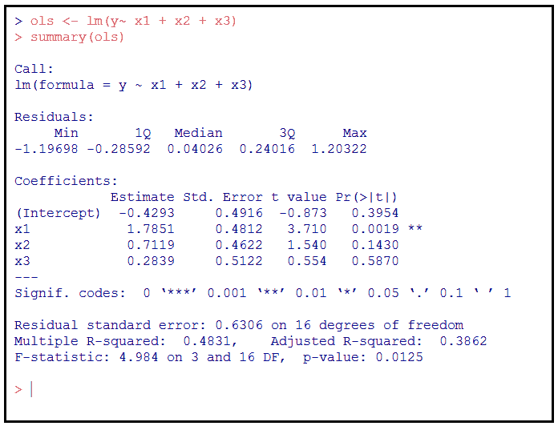

# 七、数据库改进的规范化

在这一章中，我们将介绍统计正则化的思想来改进数据模型，以帮助理解什么是统计正则化，为什么它是重要的，以及对各种统计正则化方法感到舒适。

在本章中，我们将信息分为以下几个部分:

*   统计正则化
*   使用数据理解统计正则化
*   改进数据或数据模型
*   使用 R 进行统计正则化


# 统计正则化

那么，什么是统计正则化呢？

对于正则化，无论我们谈论的是数学、统计还是机器学习，我们本质上都是在谈论添加额外信息以解决问题的过程。

术语**规则化**已经被描述为复杂系统管理的抽象概念(根据一套规则或公认的概念)。这些规则将定义如何添加或修改值以满足要求或解决问题。

添加或修改值是否意味着更改数据？(关于这一点的更多内容将在本章后面研究。)


# 各种统计正则化方法

在统计界，最流行的统计正则化方法可能包括以下几种:

*   山脉
*   套索
*   最小角度


# 山脉

岭回归是一种统计技术，用于分析存在多重共线性的回归数据或模型。当多重共线性发生时，估计值可能是无偏的，但是它们的方差通常很大，并且远离真实值。这种技术给回归估计增加了一定程度的偏差，以减少标准误差(产生更可靠的估计)。

多重共线性是统计数据中的一种情况，在这种情况下，多重回归模型中的一个预测值(变量)可以通过其他预测值以相当高的准确度进行线性预测。


# 套索

**最小绝对收缩和选择算子** ( **套索**)是一种统计技术，执行变量选择和正则化，以努力提高模型内的预测精度。

在统计模型中选择变量的过程显然会减少变量的数量，这也称为变量收缩。


# 最小角度

**最小角度回归** ( **LARS** )是数据科学家在处理高维数据时使用的一种统计技术。如果推测某个响应变量是由预测因子的特定子集决定的，那么 LARS 技术可以帮助确定回归过程中包含哪些变量。


# 正规化的机会

那么，作为一名数据科学家，你什么时候会考虑使用任何类型的正则化方法呢？

事实是，没有绝对的规则规定正则化的使用；但是，有一些需要观察的指标会让您考虑正规化，例如:

*   如果您的数据包含大量变量
*   如果观察数量与数据中变量数量的比率较低

在[第六章](4d5c8a8d-1ccd-4656-a133-8e446ffe42e1.xhtml)、*数据库进展到数据库回归*(关于统计回归)中，我们回顾了一些由咨询项目结果组成的样本数据。在这个例子中，我们研究了项目的总计费时间、项目的总项目管理时间和项目的预期盈利能力之间的关系。

仔细观察这些数据，我们可能会发现更多的变量，如下所示:

*   指派给项目的全职顾问人数
*   兼职项目顾问人数
*   分配给项目的分包商数量(全职或兼职)
*   全职分配给项目的客户资源数量
*   兼职分配给项目的客户资源数量
*   分配给项目的本地资源数量
*   多年的项目核心技术经验
*   项目管理总时数
*   总开发时间
*   每小时收费率
*   开票总小时数
*   项目中使用的技术数量
*   项目风格(时间和材料，不超过，或人员增加)

在这里，我们可以看到超过 12 个可能的独立或预测变量——当然是一个易于管理的数字——特别是考虑到文件中的观察值(记录)数量超过 100(变量与观察值的比率约为 12%)。

自变量(或实验变量或预测变量)是在模型中被操纵以观察对因变量或结果变量的影响的变量。

当数据科学家谈到高变量计数时，他们实际上指的是过多的数量，或者，如果变量的数量接近观察值的数量，(在本例中并非如此)，但假设我们只有 100 个观察值的数据中有超过 50 个可能的预测变量？这就是所谓的过于复杂的模型，需要考虑使用通用的监管方法。

什么构成过于复杂通常是一个有争议的话题，并且通常根据统计模型的数据和目标而有所不同。

经验告诉我们，当模型过于复杂时，模型可能是合适的，但是预测性能很差(这是最终目标)。当这种情况发生时，数据科学家会发现过度拟合。

正则化是数据科学家用来避免或解决这种过度拟合问题的统计技术。正则化背后的思想是，过度拟合数据的模型是复杂的统计模型，例如，有太多的参数。

利用监管的其他已知机会包括:

*   涉及高度共线性的实例
*   当项目目标是稀疏解决方案时
*   考虑高维数据中的变量分组
*   分类


# 共线性

术语**共线性**描述了一种统计情况，即一个选定的预测变量可以从其他变量中以相当高的准确度进行线性预测。

线性预测是根据以前样本的线性函数来估计变量的未来值的过程。

这通常允许对数据进行非常小的改变，以产生关于单个预测变量的不可靠的结果。也就是说，具有共线预测因子的多元回归模型可以表明整个预测因子束对结果变量的预测程度，但它可能不会给出任何单个预测因子的有效结果，或者哪些预测因子相对于其他预测因子是多余的。


# 稀疏解

**稀疏解**或**近似**是近似求解一组方程的稀疏向量。发现稀疏近似的技术在诸如图像处理和文档分析的应用中有广泛的用途。

您应该记得，向量是相同基本类型的数据点序列。向量的成员正式称为**组件**。


# 高维数据

**高维统计**是研究维数高于经典**多元分析** ( **MVA** )中考虑的维数的数据。

在统计研究中，**多元随机变量**(或**随机向量**)是一系列变量，每个变量的值都是未知的。MVA 被定义为这个场合的研究对象。

高维统计依赖于随机向量理论。在许多应用中，数据向量的维数可能大于样本大小。


# 分类

**分类**是根据包含已知类别成员的观察值(或实例)的训练数据集，识别新观察值属于哪一组类别或组的过程。

正则化是一种常用的统计技术，用于解决上述(以及其他)情况。在下一节中，我们将看一些简单的例子。


# 使用数据理解统计正则化

变量选择是统计学领域中的一个必要过程，因为它试图通过消除与输出无关的变量，使模型更容易理解，更容易训练，并且避免错误关联。

这(变量选择)是处理过拟合问题的一种可能的方法。一般来说，我们不期望一个模型完全符合我们的数据；事实上，过度拟合的问题通常意味着，如果我们将训练或测试数据拟合得太好，可能会对我们的预测模型在未知数据上的准确性不利。

正则化过程不是使用变量选择，而是减少数据中变量数量以处理过度拟合问题的替代方法，本质上是在模型训练中引入有意偏差或约束的过程，该过程(有希望)防止我们的系数表现出非常高的方差。

当(总体中的)参数数量被认为非常大时，特别是与可用的观察值数量相比，线性回归往往允许少数观察值的微小变化导致系数发生剧烈变化(或者，正如我们已经说过的，表现出非常高的方差)。

**岭回归**是一种统计方法，它将受控偏差(通过或使用约束条件)引入模型的回归估计值，但在减少模型的方差方面也很有效。

在数据科学家群体中，岭回归有时被称为一种惩罚回归技术。

有许多不同的 R 函数和包实现了岭回归，比如来自`MASS`包的`lm.ridge()`和来自`genridge`包的`ridge()`。

你可能熟悉`MASS` R 包，但可能不熟悉`genridge`。`genridge`软件包介绍了岭回归和相关方法中使用的标准单变量岭迹图的推广，值得进一步研究。

在[第 6 章](4d5c8a8d-1ccd-4656-a133-8e446ffe42e1.xhtml)、*数据库进展到数据库回归*中，我们提出了一个例子，我们根据一家咨询公司的项目结果数据创建了一个线性回归模型，试图预测项目的盈利能力。我们使用了 R 函数:`lm()`，它接受两个主要参数:`formula`(类公式的一个对象)和`data`(通常是一个`data.frame`)，如下面的 R 代码所示:

```r
# --- build linear regression model using all the
# --- project results data
alinearMod <- lm(ProjectManagement ~ Profit, data=MyData)
```

在本章中，我们将使用`lm.ridge()`函数，尝试使用岭回归来令人满意地拟合前面的线性模型。前面的代码使用我们名为`MyData`的 R 对象生成了一个线性模型，使用`ProjectManagment`变量来预测`Profit`。

`lm.ridge`函数使用以下语法:

```r
lm.ridge(formula, data, subset, na.action, lambda = 0, model = FALSE,
x = FALSE, y = FALSE, contrasts = NULL, ...)
```

此处包含的参数供以后参考:

*   `formula`:回归模型的公式表达式，形式为`response ~ predictors`
*   `data`:可选数据框，用于解释公式中出现的变量
*   `subset`:这是一个表达式，说明在拟合中应该使用数据行的哪个子集。默认情况下包括所有观察
*   `na.action`:过滤缺失数据的功能
*   `lambda`:这是山脊常数的标量或矢量
*   `model`:模型框架是否应该返回？
*   `x`:设计矩阵是否应该返回？
*   `y`:是否应该返回响应？
*   `contrasts`:用于公式中部分或全部因子项的对比列表

术语`lambda`(这里是`lm.ridge`函数中的一个参数)通常被定义为一组因变量组合的平均值的比较。

为了设置我们的下一个例子，让我们回忆一下，我们的项目数据的变量与观测值的比率为 12%。假设我们得到了一个新的数据文件，它只有 50 个观测值。现在我们的变量与观测值的比率上升到了 24%。

只有 12 个观察值的文件怎么办？此外，假设我们被告知，管理层认为这 12 个观察结果是基于关键的、高可见性的项目，因此不愿意向数据科学家提供更大的群体(至少在此时)？为这些数据建模值得吗？结果会有任何价值吗？

一般来说，回归模型中的变量越多，模型就越灵活，或者说它将变得越灵活。这种类型的模型很可能能够通过拟合训练数据中的随机波动来实现较低的误差，但结果不会代表数据中变量的真实、潜在分布，换句话说，当模型在来自相同分布的未来数据上运行时，性能会很差。(如果我们对项目盈利能力的预测是基于有缺陷的逻辑，管理层会不高兴的！)

考虑到前面的场景，数据科学家应该如何着手？当变量多于数据点时，当然有可能拟合出好的模型，但必须非常小心。

通常，当数据包含的变量多于观察值时，结果看起来可能会产生可接受的性能，但是正如我们已经提到的，解决方案可能会在训练数据上获得有利的结果甚至零误差。这种模型肯定会过度适应实际数据，因为它对于大量的训练数据来说太灵活了。(这种情况称为**不适定**或**欠定**。)

这个问题通常通过仔细设置限制或对参数施加约束来解决，或者明确地或者通过逻辑过程。然后，模型就变成了在很好地拟合数据和满足这些设定的限制或约束之间的权衡。岭回归约束或惩罚数据参数，并可以通过限制模型的灵活性来产生更好的预测性能，从而减少过度拟合的趋势。

然而，简单地设置限制或强加约束并不意味着最终的解决方案是好的或可接受的。只有当约束真正适合手头的问题或目标时，它们才会产生好的解决方案。

让我们回到前面提到的`lm.ridge`函数。与`lm`函数的使用略有不同，我们可以在下面的用例示例中看到不同之处。

对于你会发现的大多数典型例子，我们可以利用`runif`和`rnom` R 函数来生成一些随机数数据集(用于说明)，我们可以看到执行`lm`和`lm.ridge`之间的区别:

```r
# -- create a uniform random number series as X1, X2 and X3
# --- using runif
x1 <- runif(n=20)
x2 <- runif(n=20)
x3 <- runif(n=20)
# --- Create a new variable from x1 and x2
x3c <- 10*x1 + x3
# --- create a random number
ep <- rnorm(n=20)
y <- x1 + x2 + ep
```

因为我们知道我们想要探索什么(例如，估计线性回归模型中的参数)，我们可以自由地创建测试数据。以下是使用我们的三个虚构变量生成线性回归模型的 R 代码示例:

```r
# --- using the R lm function to create an ordinary least squares (OLS) # -- fit of 3-variable model using x3 as an independent x3 variable
ols <- lm(y~ x1 + x2 + x3)
summary(ols)
```

以下是上述代码生成的输出:



现在，让我们继续。

使用我们相同的虚构示例数据和类似的思路，我们可以使用 R 函数`lm.ridge`尝试使用岭回归拟合我们的线性模型:

```r
# --- Fit model using ridge regression using independent variables
ridge <- lm.ridge (y ~ x1 + x2 + x3, lambda = seq(0, .1, .001))
summary(ridge)
```

以下是生成的输出(注意由`summary`函数生成的输出的差异):


您会发现,`summary`函数在线性回归模型上产生的输出与在使用岭回归方法的模型上产生的输出不同。然而，有各种各样的软件包可用于在岭回归模型上产生足够的输出。


# 改进数据或数据模型

有各种用于改进数据或数据模型的参数。在这一部分，我们将学习其中的一些。


数据科学家可以使用许多其他可接受的或至少是众所周知的方法或途径来尝试改进统计模型(除了正则化之外),值得花些时间来提及一些最流行的方法或途径:

*   简单化
*   关联
*   速度
*   转换
*   系数的变化
*   偶然推理
*   回到正规化
*   可靠性


# 简单化

第一个可能只是简单的常识。简单的模型更容易解释和理解。算法在更简单的模型上运行效率更高，让数据科学家有更多的时间评估结果，也有更多的迭代次数。

但是，请记住，更复杂的模型更可信，所以要小心过度简化。在复杂和简单之间找到正确组合的方法可以双向进行；从简单开始，增加复杂性，或者更常见的是，从复杂开始，从模型中删除一些东西，测试，评估，然后重复，直到成功理解(拟合)过程。


# 关联

这一点似乎也很明显。换句话说，不要在统计噪音上浪费时间。使用常见的统计回归包，您将有直观的东西(如分位数-分位数图、影响图、箱线图等)来阅读和理解。花时间从模型或数据中去除不相关的东西会有回报。诀窍是能够识别什么是相关的。


# 速度

数据科学家拟合模型的速度越快，可以评估和理解的模型(和数据)就越多(最终目标！).模型优化的方法和手段可能是昂贵的——无论是在时间上还是在专业知识上——并且可能集中于模型或数据，或者两者。


# 转换

这可能会对模型产生重大影响，但并非没有风险。变量转换可以创建有意义的模型(然后可以拟合并与数据进行比较),其中包括所有相关信息，但如果不合理地进行，可能会引入偏差并暗示不正确的结果。


# 系数的变化

测试系数以确定系数是否应该随组而变化，以及估计的变化范围，是改进模型的可行方法。非常小的变化系数(跨类别)有被忽略的倾向。


# 偶然推理

你可能想建立一个单一的大型回归来回答模型或数据中存在的几个因果问题；然而，在观察环境中(包括某些感兴趣的条件是观察性的实验)，这种方法有偏差的风险。这里的底线是，不要对任何感知关系(或系数)做任何假设，尤其不要假设一个系数可以被因果解释。然而，作为一种用于改进统计模型的方法，偶然推断可能是有效的(在适当的情况下)。


# 回到正规化

抓住要点——正则化的主题是试图改进统计模型或方法的结果或性能。换句话说，通过直接和间接观察来改进学习过程(当然是从数据中)。

试图从有限数据集获取知识或学习的过程(也称为**经验学习**)被称为**欠定问题**，因为一般来说，这是试图推断一个函数`x {\displaystyle x}`，仅给出一些数据观察的例子。

另一种改进统计模型的可能方法是在模型训练期间使用**加法平滑**(也称为**拉普拉斯平滑**)。这是一种正则化形式，其工作原理是在模型训练期间向所有特征和类组合的计数添加一个固定的数字。

人们普遍认为，在一些检索任务中，如基于语言模型的应用，加法平滑比其他概率平滑方法更有效。

正则化的基本作用是在训练过程中引入额外的信息，或有意的偏差，或约束，以防止系数取大值，从而解决不适定问题。这是一种试图收缩系数的方法，也称为**收缩方法**。引入的信息往往是复杂性的惩罚形式，例如对光滑度的限制或对向量空间范数的限制。换句话说，正则化 A 做了它所暗示的事情，它规定了如何改变统计模型或其数据中的一个参数或改变多少。是的，没错，你可以更改实际数据！

什么时候改变数据的值是合理的？

统计界认为，规则化的理论依据可能是，它试图强加一种信念，即在相互竞争的假设中，假设最少的假设将是最有效的(因此应该是被选择和使用的假设)。这种信念被严格地称为**奥卡姆剃刀**(或吝啬法则)。


# 可靠性

如果一个人总是(当然，我们指的是那些我们在本章的章节*中讨论过的情况，监管的机会*。)试图在统计模型上建立一种调节方法？它会一直改进一个模型或数据群体吗？

在考虑该问题的答案之前，请记住正则化不会提高算法最初用于学习模型参数(要素权重)的数据集的性能。但是，它可以提高泛化性能(对新的、看不见的数据的性能，这正是您所寻求的)。

考虑在统计模型中使用正则化，作为对过度拟合的对策增加偏差；然而，另一方面，增加太多的偏差几乎总是会导致拟合不足，并且模型将表现不佳。

回答:正则化并不总是有效，可能会导致模型表现不佳(甚至比以前更差！).《Python 机器学习》的作者 S. Raschka 做了一个有趣的评论:

用直观的术语来说，你可以认为正则化是对(模型)复杂性的一种惩罚。增加正则化强度不利于大的权重系数。因此，您的目标是防止您的模型拾取异常或噪声，并很好地推广到新的、看不见的数据。


# 使用 R 进行统计正则化

有许多不同的函数和包实现了岭回归，比如来自`MASS`包的`lm.ridge()`和来自`genridge`包的`ridge()`。对于套索，也有`lars`包。在这一章中，我们将使用 R 的`glmnet()`函数(来自`glmnet`包),因为它是有据可查的，并且具有一致友好的界面。

使用正则化的关键是确定一个合适的`lambda`值来使用。`glmnet()`函数使用的方法是使用不同`lambda`值的网格，为每个值训练一个回归模型。然后，可以手动选择一个值，或者使用一种技术来估计最佳的`lambda`。

您可以指定要尝试的值的顺序(通过`lambda`参数)；否则，将使用具有 100 个值的默认序列。


# 参数设置

`glmnet()`函数的第一个参数必须是一个特征矩阵(我们可以使用 R 函数`model.matrix()`来创建)。第二个参数是带有输出变量的向量。最后，`alpha`参数是岭回归(0)和套索(1)之间的切换。以下代码为我们的示例进行了设置:

```r
# --- load the package 
library(glmnet) 
# --- create our parameter data 
cars_train_mat <- model.matrix(Price ~ .-Saturn, cars_train)[,-1] 
lambdas <- 10 ^ seq(8, -4, length = 250) 

```

`model.matrix` R 函数通过将因子扩展为一组汇总变量(取决于对比)并类似地扩展交互来创建矩阵。

```r

 # --- create regression model 
cars_models_ridge <-  
  glmnet(cars_train_mat, cars_train$Price, alpha = 0, lambda = lambdas) 

# --- create a lasso model 
cars_models_lasso <-  
  glmnet(cars_train_mat, cars_train$Price, alpha = 1, lambda = lambdas) 
```

我们用来设置本例中使用的数据的前面的代码(特别是，`length = 250`)提供了一个 250 个值的序列。这意味着(在前面的代码中)实际上训练了 250 个岭回归模型和另外 250 个 lasso 模型！

我们可以查看由`glmnet()`生成的`lambda`属性(属于`cars_models_ridge`对象)的值，然后将`coef()`函数应用于该对象，以检索第 100 个^(模型的相应系数，如下所示:)

```r
# --- print the value of the lambda object of the 100th model 
# --- generated by glmnet 
cars_models_ridge$lambda[100] 
[1] 1694.009 

# --- use coef to see 100th model's coefficient values 
coef(cars_models_ridge)[,100] 
  (Intercept)       Mileage      Cylinder         Doors  
 6217.5498831    -0.1574441  2757.9937160   371.2268405  
       Cruise         Sound       Leather         Buick  
 1694.6023651   100.2323812  1326.7744321  -358.8397493  
     Cadillac         Chevy       Pontiac          Saab  
11160.4861489 -2370.3268837 -2256.7482905  8416.9209564  
  convertible     hatchback         sedan  
10576.9050477 -3263.4869674 -2058.0627013 
```

最后，我们可以使用 R `plot()`函数来获得一个曲线图，显示系数值如何随着对数值的变化而变化。

如以下代码所示，并排显示岭回归和套索的相应绘图非常有帮助:

```r
# --- visualize our model data 
# --- set matrix column-widths and the row-heights 
layout(matrix(c(1, 2), 1, 2)) 

# --- create ridge regression plot 
plot(cars_models_ridge, xvar = "lambda", main = "Ridge  
   Regression\n")
```

以下是由前面的 R 代码生成的绘图图形:


这是生成`lasso`图的 R 代码:

```r
# --- create lasso plot 
plot(cars_models_lasso, xvar = "lambda", main = "Lasso\n") 
```

这是相应的输出:


前面两个图之间的显著区别是`lasso`迫使许多系数精确地降至零，而在岭回归中，它们往往平滑下降，只有在极端值时才完全为零。请注意两个图表顶部水平轴上的值，这些值显示了值变化时非零系数的数量。

除了应用正则化来最小化过拟合问题，`lasso`函数通常用于执行特征选择，因为具有零系数的特征将不包括在模型中。

作为`glmnet`包的一部分，`predict()`函数在各种环境中运行。例如，我们可以为一个不在原始列表中的`lambda`值确定模型的**系数方差** ( **CV** )百分比(两个变量之间线性关系的强度和方向)。

Predict 是一个通用函数，用于根据各种模型拟合函数的结果进行预测。

让我们试着在套索模型上使用`predict`(之前创建的)。

我们可以在之前创建的 lasso 模型上编写以下 R 代码，`cars_models_lasso`:

```r
# --- use predict function on the lasso model 
predict(cars_models_lasso, type = "coefficients", s = lambda_lasso) 

Below is the generated output, a list of the coefficient values: 

 (Intercept)  -521.3516739 
Mileage        -0.1861493 
Cylinder     3619.3006985 
Doors        1400.7484461 
Cruise        310.9153455 
Sound         340.7585158 
Leather       830.7770461 
Buick        1139.9522370 
Cadillac    13377.3244020 
Chevy        -501.7213442 
Pontiac     -1327.8094954 
Saab        12306.0915679 
convertible 11160.6987522 
hatchback   -6072.0031626 
sedan       -4179.9112364 
```

从前面的输出中，您可以看到`lasso`没有将任何系数强制为零，在这种情况下，这表明不应该从数据中移除任何系数(因此保留为模型中的特征)。


# 摘要

在这一章中，我们解释了统计正则化，然后在一个例子中使用样本数据来说明和更好地理解统计正则化。后来，我们讨论了如何通过调整来改善数据或数据模型(的性能)的各种方法。最后，我们看到了 R 语言对监管的概念和方法的支持有多好。

在下一章中，我们将讨论数据模型评估和使用统计数据进行评估的概念。我们将比较数据评估和数据质量保证的概念，最后，使用 r。